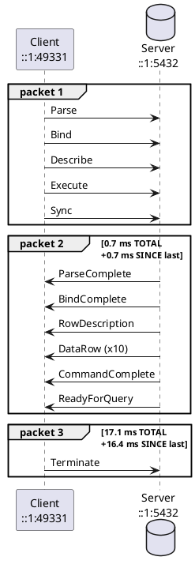
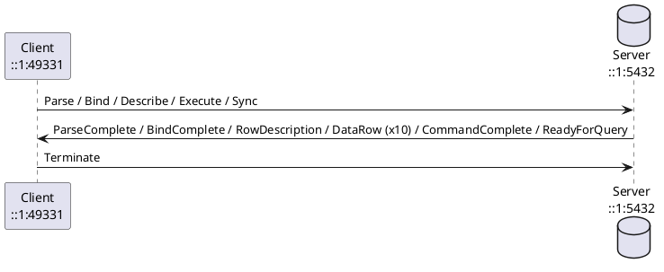

# Sequence diagram

Recorded : 2025-03-13T06:36:30.1436940Z

## Compact diagram

```plantuml
@startuml
participant "Client\n::1:49331" as C
database "Server\n::1:5432" as S
group packet 1
C -> S : Parse
C -> S : Bind
C -> S : Describe
C -> S : Execute
C -> S : Sync

end
group packet 2 [0.7 ms TOTAL\n+0.7 ms SINCE last]
S -> C : ParseComplete
S -> C : BindComplete
S -> C : RowDescription
S -> C : DataRow (x10)
S -> C : CommandComplete
S -> C : ReadyForQuery

end
group packet 3 [17.1 ms TOTAL\n+16.4 ms SINCE last]
C -> S : Terminate

end
@enduml
```

## Detailed diagram

```plantuml
@startuml
participant "Client\n::1:49331" as C
database "Server\n::1:5432" as S
C -> S : Parse / Bind / Describe / Execute / Sync

S -> C : ParseComplete / BindComplete / RowDescription / DataRow (x10) / CommandComplete / ReadyForQuery

C -> S : Terminate

@enduml
```

