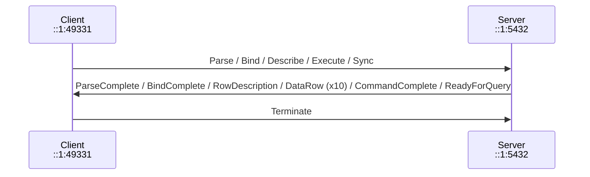
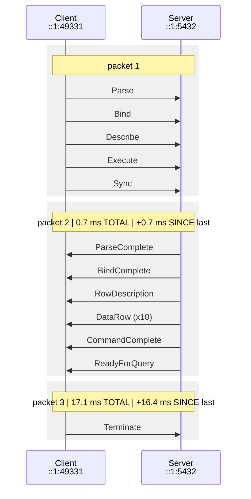
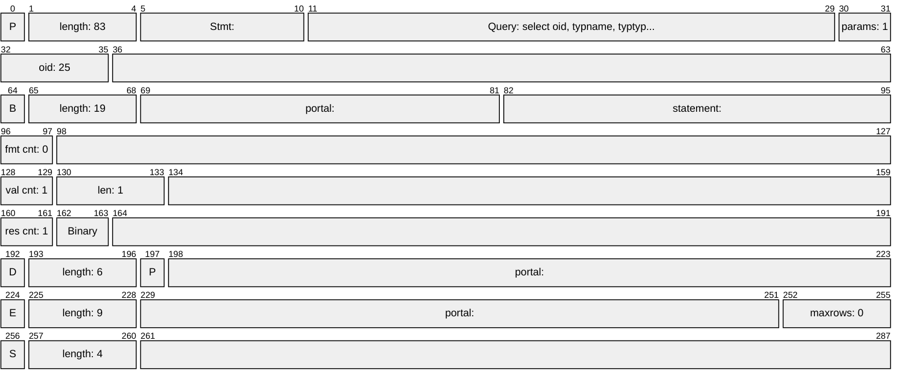
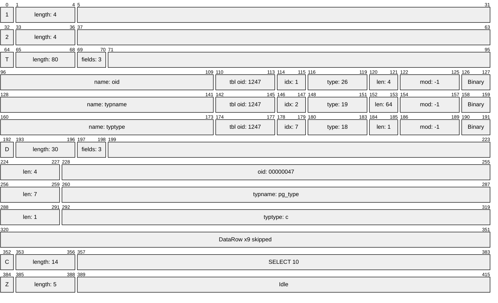
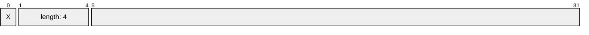

# Sequence diagram

Recorded : 2025-03-13T06:36:30.1436940Z

## Compact diagram

## Detailed diagram

## Packet detail

### Packet 1 (5 messages, FrontEnd --> BackEnd)

### Packet 2 (15 messages, FrontEnd <-- BackEnd)

### Packet 3 (1 messages, FrontEnd --> BackEnd)

