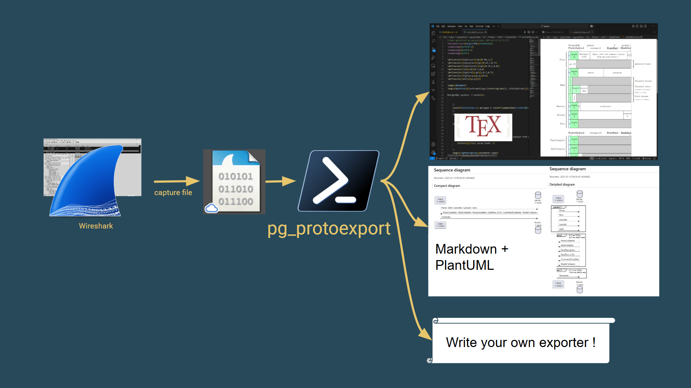

# pg_protoexport

[PostgreSQL wire protocol](https://www.postgresql.org/docs/current/protocol.html) Packet documentation generator from network capture files. Works on Mac, Linux and Windows.

It can also **record its own captures live**: a built-in `capture` command writes a `.pcapng` from a network interface for the duration of a workload, so you no longer need to start `tcpdump`/Wireshark by hand.



## Use cases

- Share PostgreSQL conversations in a meaningful way
- Document protocol
- Help diagnose connectivity issues
- Automate "capture → analyse" cycles when reproducing a PostgreSQL client behaviour

## Examples

Example capture outputs can be found in the [docs](/docs/examples/exports/extendedQuery/) page.

## How to use it

pg_protoexport is available on Windows, MacOS, Linux.

```batch
pg_protoexport <format> <capture_file> [output_path] [--port N] [OPTIONS]
```

> Run `pg_protoexport --help` to get full usage and examples
>
> Run `pg_protoexport <command> --help` to get help for a given command

### Formats

#### LaTeX

Generates LaTeX documents using the `bytefield` package to represent each protocol message.

```batch
pg_protoexport latex <capture_file> [output_path] [--port N] [OPTIONS]

OPTIONS:
    -s, --standalone    Generate standalone LaTeX documents, ideal for short messages. Leave unset to generate LaTeX articles with page breaks when possible
    -m, --multiple      One file is generated per message in standalone mode
    -x, --exact         Render each bitbox with width equal to the on-the-wire byte count of the field. Long content wraps to the next bytefield row and string content is emitted as LaTeX-escaped literal UTF-8 (no truncation)
        --row-bytes     Bytefield row width in bytes (used for wrapping in --exact mode). Default 32. Typical values: 16, 32, 64. Range: [8, 256]
```

#### PQTrace

Generates tab-separated text output similar to PostgreSQL's `pg_pqtrace` tool.

```batch
pg_protoexport pqtrace <capture_file> [output_path] [--port N]
```

#### Mermaid

Generates Markdown files with embedded [Mermaid](https://mermaid.js.org) diagrams.

Two sub-commands are available:

- **sequenceDiagram** — generates `sequenceDiagram` blocks showing message flow between client and server, splitting at `ReadyForQuery` or `Terminate` boundaries
- **packet** — generates `packet` diagrams for each message with exact byte-level wire format representation

```batch
pg_protoexport mermaid <capture_file> sequenceDiagram [output_path] [--port N]
pg_protoexport mermaid <capture_file> packet [output_path] [--port N]
```

#### PlantUML

Generates Markdown files with embedded [PlantUML](https://plantuml.com) diagrams.

Two sub-commands are available, mirroring the Mermaid exporter:

- **sequenceDiagram** — generates `@startuml` sequence diagrams showing client/server message flow, splitting at `ReadyForQuery` or `Terminate` boundaries
- **packet** — generates one `@startjson` diagram per packet, rendering each message as a tree of `"field": "value (N bytes)"` entries (PlantUML has no native packet diagram type; the JSON tree is its closest equivalent)

```batch
pg_protoexport plantuml <capture_file> sequenceDiagram [output_path] [--port N]
pg_protoexport plantuml <capture_file> packet [output_path] [--port N]
```

#### HTML

Generates a self-contained "guided reading" HTML report — a single scrollable document
where each protocol message is a card with a plain-English headline, parsed fields, raw bytes,
a "why this message, why now?" rationale, and a protocol-state sidebar that updates as you
scroll. Includes Mermaid sequence diagrams and a glossary with links to the PostgreSQL docs.

```batch
pg_protoexport html <capture_file> [output_path] [--port N]
```

The command writes `<output_path>` plus a sibling `<output_path_without_extension>_assets/`
directory containing `styles.css`, `app.js`, and a vendored `mermaid.min.js`. Open the
`.html` file directly in a browser — no server required.

#### ASCII

Generates a plain-text diagram where each parsed field is a labelled, content-sized box (with a `(N bytes)` annotation on multi-byte fields) — handy for pasting protocol layouts into terminals, code comments, or plain-text docs.

```batch
pg_protoexport ascii <capture_file> [output_path] [--port N] [OPTIONS]

OPTIONS:
        --max-width     Maximum characters per output line before cells wrap to a new row. Default 160. Range: [40, 400]
```

### Arguments

- **capture_file**: Capture file to translate (.pcapng, .pcap)
- **output_path**: Output file path. Leave empty to generate a file at the same location as input file, with appropriate extension. If `multiple` option is on for latex output, a directory is expected.
- **--port N**: PostgreSQL port to filter on. If omitted, auto-detected from each capture's TCP SYN handshake (or packet-count majority for mid-conversation captures).

## Live capture

`pg_protoexport` ships with a `capture` command that records a `.pcapng` from a live NIC. SharpPcap drives the capture in-process — no external `tcpdump`/`dumpcap` is needed — and the resulting file is identical to what you'd get from Wireshark, so it round-trips into every other format the tool produces.

```batch
pg_protoexport capture <output_path> [OPTIONS]

OPTIONS:
        --host          PostgreSQL host (used to auto-pick the capture NIC). Defaults to localhost
        --port          PostgreSQL port. Defaults to 5432
        --device        Capture device override (Name or Description). Auto-picked from --host if omitted
        --duration      Capture duration (e.g. 30s, 5m). If omitted, capture runs until Ctrl+C
        --list-devices  List available capture devices and exit
        --quiet         Do not echo per-packet lines to the console while capturing
```

While capturing, each packet is echoed to the console using the same one-line format the file-reading `PcapService` already produces — `HH:MM:SS,ms Len=N srcIp:srcPort -> dstIp:dstPort` — so a live capture and a post-hoc replay of the same file print identical lines. Pass `--quiet` to suppress.

Example: capture localhost traffic for 30 seconds, then turn it into a guided HTML report.

```batch
pg_protoexport capture pagila.pcapng --duration 30s
pg_protoexport html pagila.pcapng pagila.html
```

The device picker resolves `--host` to an IP and chooses the matching NIC (loopback adapter for `localhost`, the routing interface for remote hosts). Use `--list-devices` if you need to override the choice with `--device`.

**Requirements.** Live capture needs the same OS dependency as reading a capture: Npcap on Windows (with WinPcap API-compatible mode enabled, for loopback support) or libpcap with `CAP_NET_RAW` / root on Linux/Mac.

### Capture + workload in one command

The `pg_protoexport.samples.pagila` project ships a `capture-and-generate` verb that runs a representative [pagila](https://github.com/xzilla/pagila) workload (the 13 PostgreSQL wire-protocol scenarios in `PagilaTrafficGenerator`) and writes **one `.pcapng` file per scenario** — each scenario runs inside its own `LiveCaptureSession`, so the resulting files contain exactly that scenario's wire activity and nothing else. Connection settings are read from the standard libpq env vars (`PGHOST`, `PGPORT`, `PGUSER`, `PGPASSWORD`, `PGDATABASE`, `PGSSLMODE`).

```batch
dotnet run --project pg_protoexport.samples.pagila -- capture-and-generate pagila.pcapng
```

Produces (next to the base name):

```text
pagila-00-startup-handshake-startup-authentication-parameterstatus-readyforquery.pcapng
pagila-01-simple-query-single-statement.pcapng
pagila-02-empty-query-emptyqueryresponse.pcapng
pagila-03-simple-query-batched-statements.pcapng
...
pagila-13-cancelrequest.pcapng
```

Scenario `00` captures the connection's startup handshake (Startup, Authentication, ParameterStatus, ReadyForQuery). Terminate (X) is emitted on connection dispose, after the last scenario, and does not appear in any per-scenario file.

Under the hood, `PagilaTrafficGenerator.RunAsync` accepts an optional `Func<int, string, Func<Task>, Task>? scenarioWrapper` so external orchestrators can interpose per-scenario behavior (start/stop a capture session, time the scenario, etc.) without touching the workload itself.

### Batch export — every exporter, every variant, over a directory of captures

The `batchexport` command walks a directory of `.pcapng` / `.pcap` files and runs every exporter the tool exposes — including the multi-mode ones (mermaid sequence + packet, plantuml sequence + packet) — over each input. Outputs land in a per-input subfolder under the chosen output directory.

```batch
dotnet run --project pg_protoexport -- batchexport docs/examples/captures docs/examples/exports
dotnet run --project pg_protoexport -- batchexport docs/examples/captures docs/examples/exports --port 5432 --recursive
```

The port is optional — when omitted, each capture's PostgreSQL port is auto-detected from its TCP SYN handshake (`IPcapPortDetector`). Pass `--port N` to force a specific port.

Produces, for each input `pagila-01-simple-query-single-statement.pcapng`:

```text
docs/examples/exports/pagila-01-simple-query-single-statement/
├── capture.tex                 # latex standalone
├── capture.pqtrace.txt         # PQTrace-style tab-separated
├── capture.ascii.txt           # ASCII-art labelled boxes
├── capture.mermaid.seq.md      # mermaid sequenceDiagram
├── capture.mermaid.pkt.md      # mermaid packet
├── capture.plantuml.seq.md     # plantuml sequence (@startuml)
├── capture.plantuml.pkt.md     # plantuml packet  (@startjson)
├── capture.html                # self-contained guided-reading report
└── capture_assets/             # styles.css, app.js, mermaid.min.js
```

The committed `docs/examples/captures/` + `docs/examples/exports/` tree was produced by running `pg_protoexport.samples.pagila` followed by `pg_protoexport batchexport docs/examples/captures docs/examples/exports` (port auto-detected as 5434 for these captures — the pagila DB happens to run on a non-standard port). The fourteenth capture, `pagila-13-cancelrequest.pcapng`, exercises the `CancelRequest` startup-phase message that earlier versions of the parser couldn't decode; it now renders end-to-end.

### Using the library directly

`LiveCaptureSession` is an `IAsyncDisposable`, so any workload sits naturally inside an `await using` block — disposal stops the capture and flushes the file even if the workload throws.

```csharp
using ILoggerFactory loggerFactory = LoggerFactory.Create(b => b.AddConsole());

var options = new LiveCaptureOptions("pagila.pcapng")
{
    Host = "localhost",
    Port = 5432,
};

await using (var session = await LiveCaptureSession.StartAsync(options, loggerFactory))
{
    await RunYourWorkloadAsync();
}
// pagila.pcapng is now on disk
```

With DI, register `AddLiveCapture()` and inject `ILiveCaptureSessionFactory` instead of calling the static factory.

## How to build

You will need the .NET 10 SDK to build the project.

### Dependencies

- [.NET 10](https://dotnet.microsoft.com)
- [SharpPcap](https://github.com/dotpcap/sharppcap) for capture files packet handling (depends on libpcap, Npcap), included as a NuGet package
- [Spectre.Console](https://spectreconsole.net/) for awesome CLI features, included as a NuGet package

### Build from your favorite IDE

Open the `pg_protoexport.slnx` solution file and build!

### Build from the .NET CLI

```batch
dotnet build pg_protoexport.slnx
```

## Internals

### Components

pg_protoexport is made of a core parsing service and pluggable exporters:

- **PcapService** (`pg_protoexport.core`)

  **Responsible** for reading capture files and transforming them into `IEnumerable<PostgresPacket>`.
  
  Each `PostgresPacket` contains messages sent/received under the `Messages` property.  
  Each message is derived from `PostgresMessageBase` class and is a full blown message class reflecting the message contents according to the [PostgreSQL message formats documentation](https://www.postgresql.org/docs/current/protocol-message-formats.html).

- **LiveCaptureSession** (`pg_protoexport.core`)

  **Responsible** for live packet capture: writes a `.pcapng` from a NIC for the duration of a workload. Returned by `LiveCaptureSession.StartAsync(LiveCaptureOptions, ...)` as an `IAsyncDisposable` — disposal stops the capture and flushes the file. `PcapDevicePicker` resolves the NIC from the host (loopback / routing interface / explicit override). The DI seam is `ILiveCaptureSessionFactory`, registered by `AddLiveCapture()`.

- **PcapToLatexService** (`pg_protoexport.export.latex`)

  **Responsible** for LaTeX file generation from `PostgresPacket` list.

  Uses [T4 templates](https://learn.microsoft.com/en-us/visualstudio/modeling/code-generation-and-t4-text-templates?view=vs-2022) for clean separation. Each template **MUST** implement the `ITextTransformer` interface. This interface has two members: `TransformText` which is already implemented by the T4 template, and `EstimateBytefieldRowCount` which is useful when LaTeX is written as an *article* document; it provides the *bytefield* (message) height, needed for page breaking at the right place.

- **PcapToPqTraceService** (`pg_protoexport.export.pqtrace`)

  **Responsible** for PQTrace-style tab-separated text output from `PostgresPacket` list.

- **PcapToMermaidService** (`pg_protoexport.export.mermaid`)

  **Responsible** for Markdown generation with embedded Mermaid diagrams. Supports sequence diagrams (splitting at `ReadyForQuery`/`Terminate` boundaries) and packet diagrams with byte-accurate wire format rendering.

- **PcapToPlantUmlService** (`pg_protoexport.export.plantuml`)

  **Responsible** for Markdown generation with embedded PlantUML diagrams. Same two modes as the Mermaid exporter: sequence diagrams (`@startuml`) and per-packet field trees (`@startjson`).

- **PcapToHtmlService** (`pg_protoexport.export.html`)

  **Responsible** for the self-contained "guided reading" HTML report. Builds one card per
  message using `ProtocolStateProjector` (in `pg_protoexport.core`) to track the observable
  protocol state (connection state, transaction status, prepared statements, portals, server
  parameters), embeds Mermaid sequence diagrams produced by `PcapToMermaidService`, and
  inlines everything into an embedded HTML template alongside a small `<name>_assets/`
  folder for styles, scripts, and Mermaid. Requires `PcapPostgresOptions.RecordFieldMetadata`
  (turned on automatically by `AddHtmlExporter()`) so the parser exposes the per-field
  offset/length needed for the byte-level highlighting.

### Design

pg_protoexport is Dependency Injection friendly. It uses [`ILogger`](https://learn.microsoft.com/en-us/dotnet/core/extensions/logging?tabs=command-line) for structured logging and the [`Options` pattern](https://learn.microsoft.com/en-us/dotnet/core/extensions/options) for configuration.

This is how you would bootstrap the pg_protoexport pipeline using Spectre console as logging destination and pg_protoexport with default options:

```csharp
var serviceCollection = new ServiceCollection()
    .AddLogging(configure => configure.AddSpectreConsole())
    .AddPcapService()
    .AddLiveCapture()
    .AddLatexExporter()
    .AddPqTraceExporter()
    .AddMermaidExporter()
    .AddPlantUmlExporter()
    .AddHtmlExporter()
    .AddAsciiExporter();
```

> `AddHtmlExporter()` depends on `AddMermaidExporter()` and turns on
> `PcapPostgresOptions.RecordFieldMetadata` so the parser captures the per-field offsets
> and lengths the report needs.
>
> Each `Add{Format}Exporter()` also registers an `IExporterCliModule`, the seam the CLI host
> uses to discover and self-register that exporter's command(s) and `batchexport` variants —
> so adding an exporter never edits the `pg_protoexport` CLI project beyond one composition line.

**Note** : Dependency injection is not required though. Default factories are available in that case (see the `BasicSample` project):

```csharp
// With LoggerFactory
using ILoggerFactory loggerFactory = LoggerFactory.Create(builder => builder.AddConsole());

// Capture
IPcapService pcap = PcapService.Create(loggerFactory); // factory is optional
List<PostgresPacket> pgPackets = pcap.ConvertPcap(inputFile, portNumber).ToList();

// Transform to LaTeX
IPcapToLatexService latex = PcapToLatexService.Create(loggerFactory); // factory is optional
latex.PcapToLaTeX(pgPackets, outputFile, standalone: true);

// Transform to Mermaid
IPcapToMermaidService mermaid = PcapToMermaidService.Create(loggerFactory);
mermaid.PcapToSequenceDiagram(pgPackets, "output.md");
mermaid.PcapToPacketDiagram(pgPackets, "output_packets.md");

// Transform to PlantUML
IPcapToPlantUmlService plantuml = PcapToPlantUmlService.Create(loggerFactory);
plantuml.PcapToSequenceDiagram(pgPackets, "output_plantuml.md");
plantuml.PcapToPacketDiagram(pgPackets, "output_plantuml_packets.md");

// Transform to HTML report
// Note: without DI, enable field metadata yourself so the report can highlight bytes.
var htmlOptions = new PcapPostgresOptions { RecordFieldMetadata = true }.AddDefaultPostgresMessages();
IPcapService pcapForHtml = PcapService.Create(loggerFactory, htmlOptions);
List<PostgresPacket> packetsForHtml = pcapForHtml.ConvertPcap(inputFile, portNumber).ToList();

IPcapToHtmlService html = PcapToHtmlService.Create(loggerFactory);
html.PcapToHtml(packetsForHtml, "report.html");
```

## Extensibility

- Custom packet handlers

  You can add support for non-standard messages via `PcapPostgresOptions`.

  1. Add a message definition for front-end or back-end
  2. Add an handler for this message, ie: your `PostgresMessageBase` derived class generator when the message defined in 1. is encountered while reading the capture.

- Custom LaTeX templates

  When a message needs to be written as LaTex, if no suitable converter is found, a call to `PcapToLatexOptions.CustomTemplateProvider` delegate will be made

  1. Write your T4 template or any implementation of `ITextTransformer`
  2. Return this instance in the `CustomTemplateProvider` call

> LaTeX header file can be also be replaced using `PcapToLatexOptions.CustomHeaderProvider`

Full example:

```csharp
services.Addpg_protoexport(
    captureOptions =>
    {
        // Create message definition
        PostgresMessage myNewFrontEndMessage = new PostgresMessage('X', "NewFrontEndMessage", IsFrontEnd: true);

        // Add message definition
        captureOptions.MessageCatalog.AddOrReplaceFrontendMessage(myNewFrontEndMessage);

        // Add message handler
        captureOptions.CustomMessageProcessor = (PostgresMessage pgMessage, ParserInfo info) =>
        {
            if (pgMessage.Code == 'X')
            {
                return MyMessageClass.Read(pgMessage, info.Reader);
            }
            return null;
        };
    },
    latexOptions =>
    {
        // Returns ITextTransformer for the given message (a T4 template)
        latexOptions.CustomTemplateProvider = (PostgresMessageBase message) =>
        {
            if (message.Code == 'X')
                return MyT4Template.Read(message);

            return null;
        };

        // You can also customize LaTeX Header file (to import plugins or add colors)
        latexOptions.CustomHeaderProvider = (string? message, GenerationState state) => new MyT4HeaderFile(message, state);
    }
);
```

## Core helpers available to exporters

These are the reusable building blocks an exporter can lean on, all in `pg_protoexport.core`. New exporters should prefer these over reinventing the same logic.

- `IPcapExporter` (`Exporters/IPcapExporter.cs`, in `pg_protoexport.core`) — the contract every exporter implements alongside its typed `IPcapTo{Format}Service` interface. Carries `Name`, `DefaultExtension`, and a single `Export(packets, outputPath, mode, options)` method (`mode` selects the output shape for multi-mode exporters like Mermaid/PlantUML and is ignored otherwise). The CLI host dispatches through this. See `PcapToHtmlService`, `PcapToPqTraceService`, or `PcapToMermaidService` for canonical implementations (single-mode, multi-mode, and options-bearing respectively).

- `IExporterCliModule` (`pg_protoexport.cli.abstractions`) — the CLI self-registration seam. Each exporter project ships one implementation that registers its Spectre command(s) and declares its `batchexport` variants; the CLI host discovers them all via DI. This is what keeps the `pg_protoexport` CLI project immune to new exporters — its command surface and the batch variant list are assembled from the registered modules, not hard-coded. The exporter's CLI command + settings live in the exporter project too (which therefore references `Spectre.Console.Cli`).

- `IExportOptions` / `IExportResult` — marker types for per-exporter options and stat counters. Exporters with no per-call options pass `null`; exporters that do not track counters return `EmptyExportResult`. LaTeX shows the non-trivial case (`LatexExportOptions`, `LatexExportResult`).

- `PostgresPacketSequence` (`Sequence/PostgresPacketSequence.cs`) — `GroupMessages(packet)` collapses consecutive identical messages into `(message, count)` pairs; `BuildSequenceLines(packet)` produces the per-line shape used by sequence-style exporters. Mermaid and PlantUML both consume these directly.

- `SessionEndpoints` (`Sequence/SessionEndpoints.cs`) — extracts client/server addresses and ports from the first packet of a capture, plus splits packet streams at `ReadyForQuery` / `Terminate` boundaries.

- `ProtocolStateProjector` + `ProtocolStateSnapshot` (`Sequence/ProtocolStateProjector.cs`) — folds over a packet stream and yields a `ProtocolStateSnapshot` after every message (connection state, transaction status, prepared statements, portals, server params, backend PID). Any exporter that wants to show "what is the protocol state at this point" gets this for free. The HTML exporter is the first consumer.

- `PcapPostgresOptions.RecordFieldMetadata` (`Configuration/PcapPostgresOptions.cs`) — opt-in flag that makes the parser record `(name, offset, length)` metadata on `PostgresMessageBase.ParsedFields` for every field it reads. Off by default to keep existing exporters byte-identical and avoid per-field allocations. Turn it on (via `services.PostConfigure<PcapPostgresOptions>(o => o.RecordFieldMetadata = true)`) when your exporter needs per-field byte ranges; the HTML exporter does this automatically.

## Contact

If you have any issue or question, feel free to use this repo as an entry point, using issues or discussions.
Contributions are welcome !
