# Packet 1 (5 messages, FrontEnd --> BackEnd)

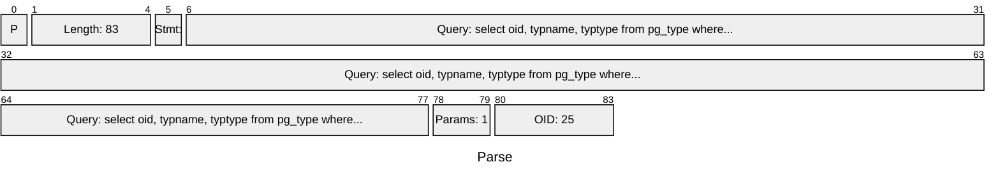
```mermaid
---
title: "Parse"
config:
  packet:
    bitsPerRow: 32
---
packet
    +1: "P"
    +4: "Length: 83"
    +1: "Stmt: "
    +72: "Query: select oid, typname, typtype from pg_type where..."
    +2: "Params: 1"
    +4: "OID: 25"
```

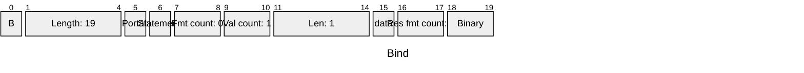
```mermaid
---
title: "Bind"
config:
  packet:
    bitsPerRow: 32
---
packet
    +1: "B"
    +4: "Length: 19"
    +1: "Portal: "
    +1: "Statement: "
    +2: "Fmt count: 0"
    +2: "Val count: 1"
    +4: "Len: 1"
    +1: "data"
    +2: "Res fmt count: 1"
    +2: "Binary"
```

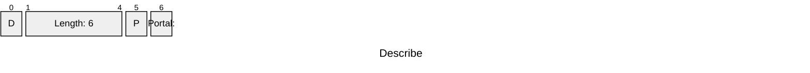
```mermaid
---
title: "Describe"
config:
  packet:
    bitsPerRow: 32
---
packet
    +1: "D"
    +4: "Length: 6"
    +1: "P"
    +1: "Portal: "
```

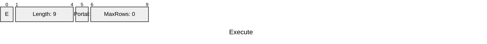
```mermaid
---
title: "Execute"
config:
  packet:
    bitsPerRow: 32
---
packet
    +1: "E"
    +4: "Length: 9"
    +1: "Portal: "
    +4: "MaxRows: 0"
```

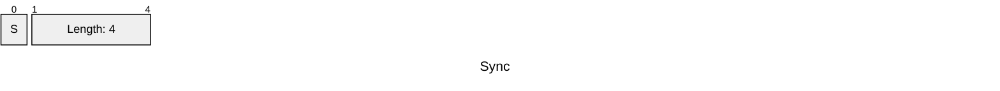
```mermaid
---
title: "Sync"
config:
  packet:
    bitsPerRow: 32
---
packet
    +1: "S"
    +4: "Length: 4"
```

# Packet 2 (15 messages, FrontEnd <-- BackEnd)

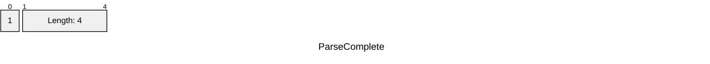
```mermaid
---
title: "ParseComplete"
config:
  packet:
    bitsPerRow: 32
---
packet
    +1: "1"
    +4: "Length: 4"
```

```mermaid
---
title: "BindComplete"
config:
  packet:
    bitsPerRow: 32
---
packet
    +1: "2"
    +4: "Length: 4"
```

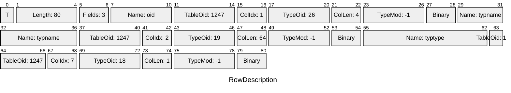
```mermaid
---
title: "RowDescription"
config:
  packet:
    bitsPerRow: 32
---
packet
    +1: "T"
    +4: "Length: 80"
    +2: "Fields: 3"
    +4: "Name: oid"
    +4: "TableOid: 1247"
    +2: "ColIdx: 1"
    +4: "TypeOid: 26"
    +2: "ColLen: 4"
    +4: "TypeMod: -1"
    +2: "Binary"
    +8: "Name: typname"
    +4: "TableOid: 1247"
    +2: "ColIdx: 2"
    +4: "TypeOid: 19"
    +2: "ColLen: 64"
    +4: "TypeMod: -1"
    +2: "Binary"
    +8: "Name: typtype"
    +4: "TableOid: 1247"
    +2: "ColIdx: 7"
    +4: "TypeOid: 18"
    +2: "ColLen: 1"
    +4: "TypeMod: -1"
    +2: "Binary"
```

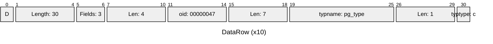
```mermaid
---
title: "DataRow (x10)"
config:
  packet:
    bitsPerRow: 32
---
packet
    +1: "D"
    +4: "Length: 30"
    +2: "Fields: 3"
    +4: "Len: 4"
    +4: "oid: 00000047"
    +4: "Len: 7"
    +7: "typname: pg_type"
    +4: "Len: 1"
    +1: "typtype: c"
```

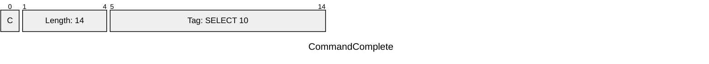
```mermaid
---
title: "CommandComplete"
config:
  packet:
    bitsPerRow: 32
---
packet
    +1: "C"
    +4: "Length: 14"
    +10: "Tag: SELECT 10"
```

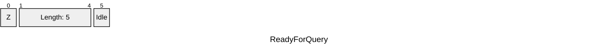
```mermaid
---
title: "ReadyForQuery"
config:
  packet:
    bitsPerRow: 32
---
packet
    +1: "Z"
    +4: "Length: 5"
    +1: "Idle"
```

# Packet 3 (1 messages, FrontEnd --> BackEnd)

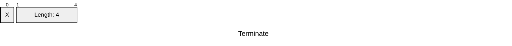
```mermaid
---
title: "Terminate"
config:
  packet:
    bitsPerRow: 32
---
packet
    +1: "X"
    +4: "Length: 4"
```

