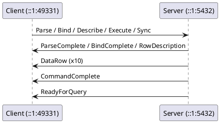
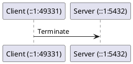

```plantuml
@startuml
participant "Client (::1:49331)" as C
participant "Server (::1:5432)" as S
C -> S : Parse / Bind / Describe / Execute / Sync
S -> C : ParseComplete / BindComplete / RowDescription
S -> C : DataRow (x10)
S -> C : CommandComplete
S -> C : ReadyForQuery
@enduml
```

```plantuml
@startuml
participant "Client (::1:49331)" as C
participant "Server (::1:5432)" as S
C -> S : Terminate
@enduml
```
