# Packet 1 (1 messages, FrontEnd --> BackEnd)

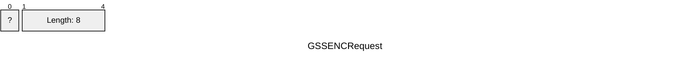


# Packet 2 (1 messages, FrontEnd <-- BackEnd)

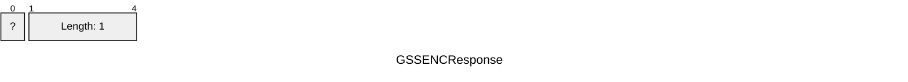


# Packet 3 (1 messages, FrontEnd --> BackEnd)

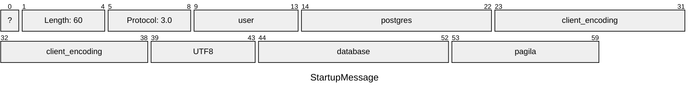


# Packet 4 (1 messages, FrontEnd <-- BackEnd)

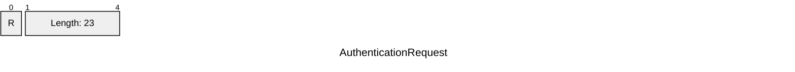


# Packet 5 (1 messages, FrontEnd --> BackEnd)

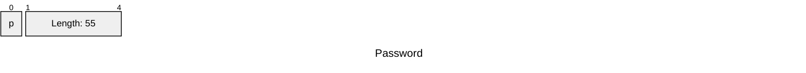


# Packet 6 (1 messages, FrontEnd <-- BackEnd)

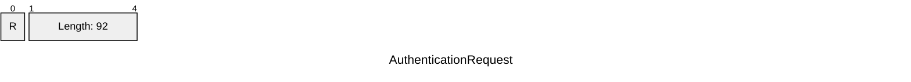


# Packet 7 (1 messages, FrontEnd --> BackEnd)

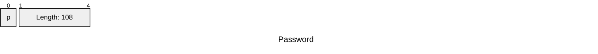


# Packet 8 (19 messages, FrontEnd <-- BackEnd)

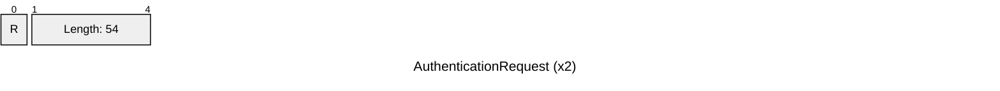

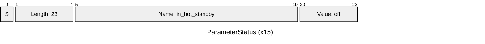

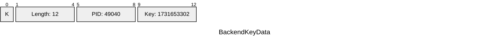

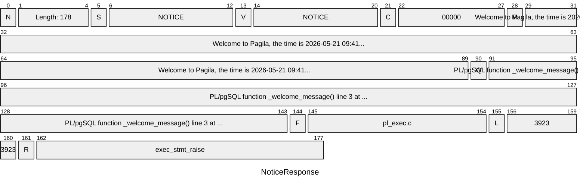


# Packet 9 (1 messages, FrontEnd <-- BackEnd)

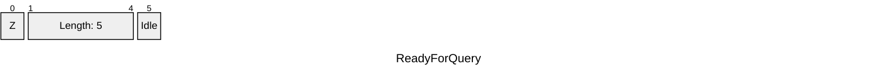


# Packet 10 (1 messages, FrontEnd --> BackEnd)

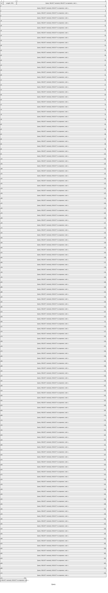


# Packet 11 (145 messages, FrontEnd <-- BackEnd)

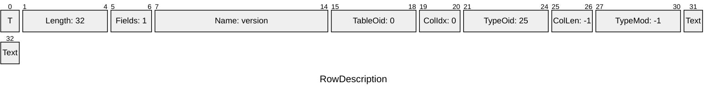

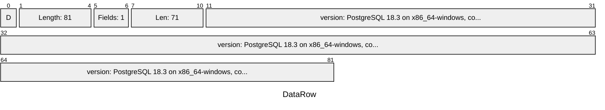

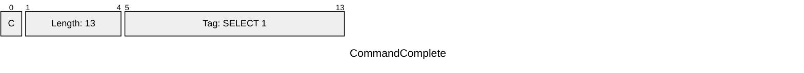

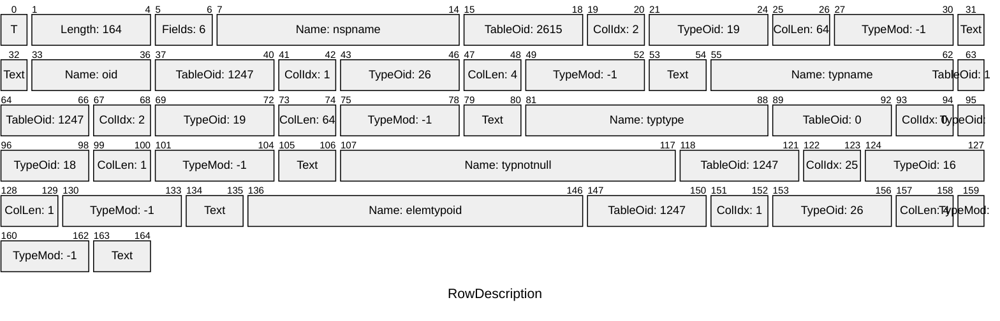

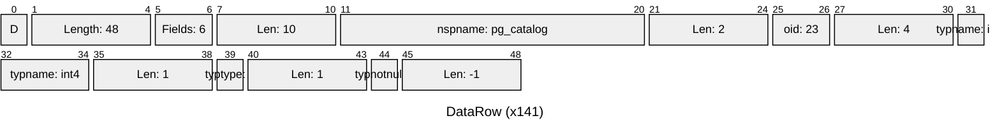


# Packet 12 (46 messages, FrontEnd <-- BackEnd)

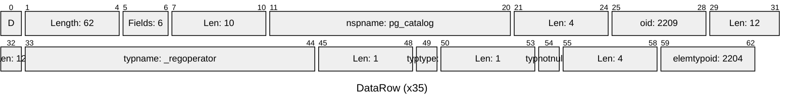

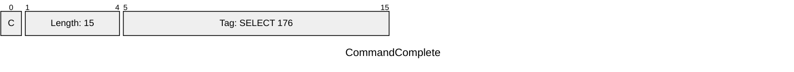

```mermaid
---
title: "RowDescription"
config:
  packet:
    bitsPerRow: 32
---
packet
    +1: "T"
    +4: "Length: 81"
    +2: "Fields: 3"
    +4: "Name: oid"
    +4: "TableOid: 1247"
    +2: "ColIdx: 1"
    +4: "TypeOid: 26"
    +2: "ColLen: 4"
    +4: "TypeMod: -1"
    +2: "Text"
    +8: "Name: attname"
    +4: "TableOid: 1249"
    +2: "ColIdx: 2"
    +4: "TypeOid: 19"
    +2: "ColLen: 64"
    +4: "TypeMod: -1"
    +2: "Text"
    +9: "Name: atttypid"
    +4: "TableOid: 1249"
    +2: "ColIdx: 3"
    +4: "TypeOid: 26"
    +2: "ColLen: 4"
    +4: "TypeMod: -1"
    +2: "Text"
```

```mermaid
---
title: "CommandComplete"
config:
  packet:
    bitsPerRow: 32
---
packet
    +1: "C"
    +4: "Length: 13"
    +9: "Tag: SELECT 0"
```

```mermaid
---
title: "RowDescription"
config:
  packet:
    bitsPerRow: 32
---
packet
    +1: "T"
    +4: "Length: 56"
    +2: "Fields: 2"
    +4: "Name: oid"
    +4: "TableOid: 1247"
    +2: "ColIdx: 1"
    +4: "TypeOid: 26"
    +2: "ColLen: 4"
    +4: "TypeMod: -1"
    +2: "Text"
    +10: "Name: enumlabel"
    +4: "TableOid: 3501"
    +2: "ColIdx: 4"
    +4: "TypeOid: 19"
    +2: "ColLen: 64"
    +4: "TypeMod: -1"
    +2: "Text"
```

```mermaid
---
title: "DataRow (x5)"
config:
  packet:
    bitsPerRow: 32
---
packet
    +1: "D"
    +4: "Length: 22"
    +2: "Fields: 2"
    +4: "Len: 7"
    +7: "oid: 1469004"
    +4: "Len: 1"
    +1: "enumlabel: G"
```

```mermaid
---
title: "CommandComplete"
config:
  packet:
    bitsPerRow: 32
---
packet
    +1: "C"
    +4: "Length: 13"
    +9: "Tag: SELECT 5"
```

```mermaid
---
title: "ReadyForQuery"
config:
  packet:
    bitsPerRow: 32
---
packet
    +1: "Z"
    +4: "Length: 5"
    +1: "Idle"
```

