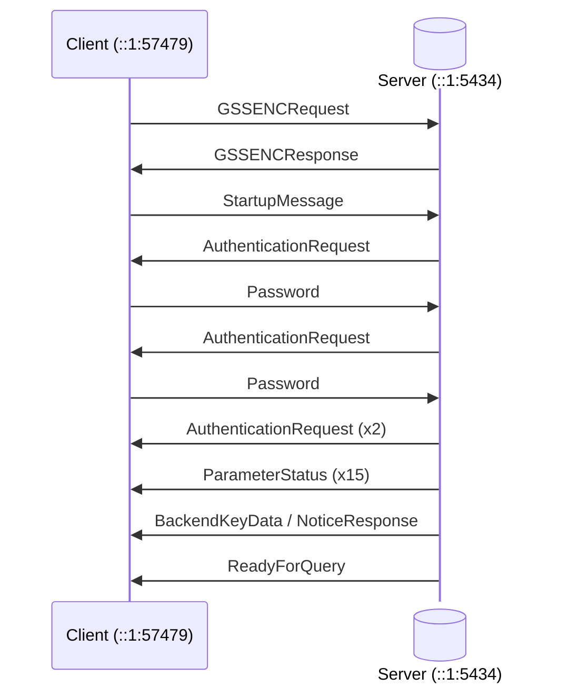
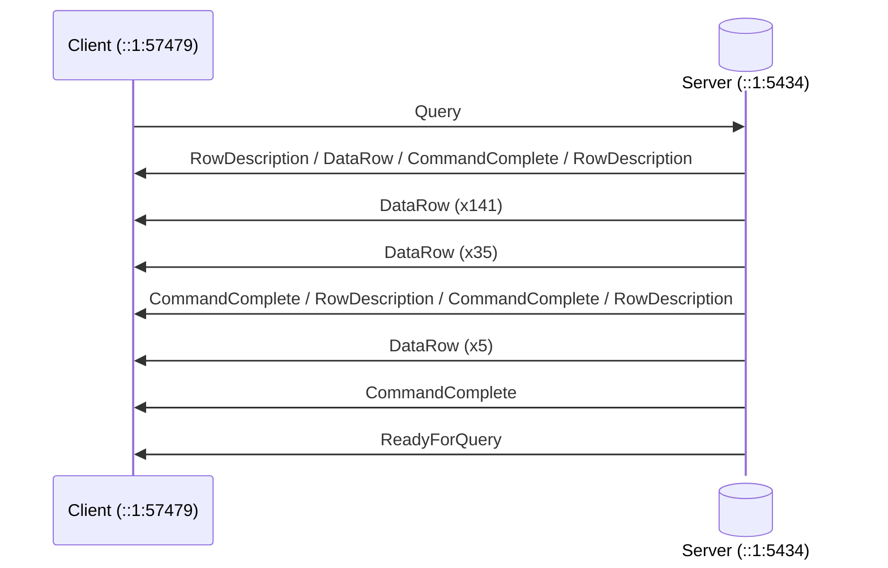

```mermaid
sequenceDiagram
    participant C as Client (::1:57479)
    participant S@{ "type" : "database" } as Server (::1:5434)
    C->>S: GSSENCRequest
    S->>C: GSSENCResponse
    C->>S: StartupMessage
    S->>C: AuthenticationRequest
    C->>S: Password
    S->>C: AuthenticationRequest
    C->>S: Password
    S->>C: AuthenticationRequest (x2)
    S->>C: ParameterStatus (x15)
    S->>C: BackendKeyData / NoticeResponse
    S->>C: ReadyForQuery
```

```mermaid
sequenceDiagram
    participant C as Client (::1:57479)
    participant S@{ "type" : "database" } as Server (::1:5434)
    C->>S: Query
    S->>C: RowDescription / DataRow / CommandComplete / RowDescription
    S->>C: DataRow (x141)
    S->>C: DataRow (x35)
    S->>C: CommandComplete / RowDescription / CommandComplete / RowDescription
    S->>C: DataRow (x5)
    S->>C: CommandComplete
    S->>C: ReadyForQuery
```
