# Packet 1 (1 messages, FrontEnd --> BackEnd)

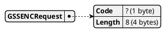


# Packet 2 (1 messages, FrontEnd <-- BackEnd)

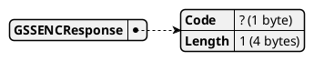


# Packet 3 (1 messages, FrontEnd --> BackEnd)

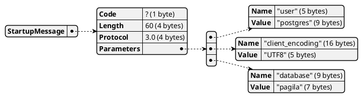


# Packet 4 (1 messages, FrontEnd <-- BackEnd)


# Packet 5 (1 messages, FrontEnd --> BackEnd)

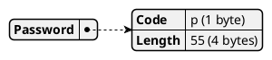


# Packet 6 (1 messages, FrontEnd <-- BackEnd)

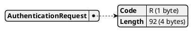


# Packet 7 (1 messages, FrontEnd --> BackEnd)

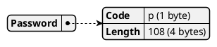


# Packet 8 (19 messages, FrontEnd <-- BackEnd)

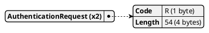

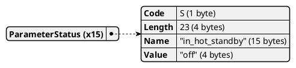

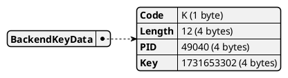

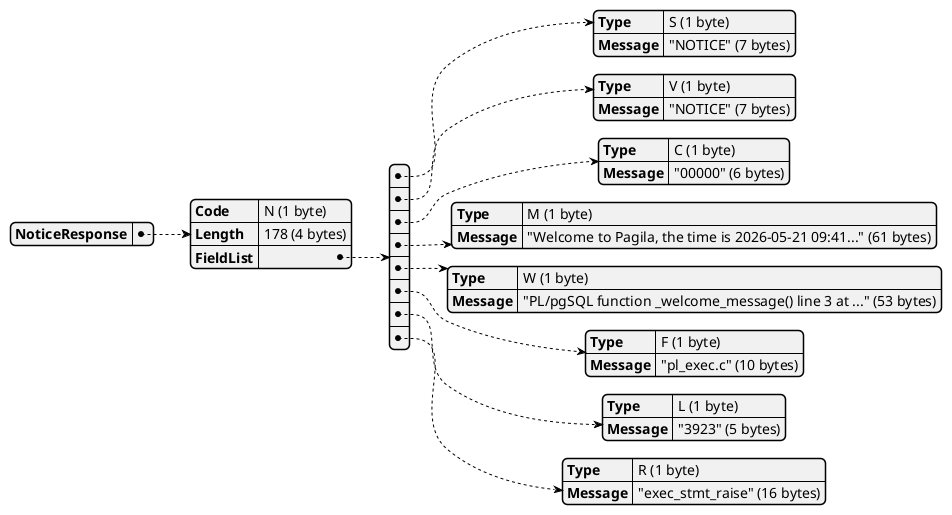


# Packet 9 (1 messages, FrontEnd <-- BackEnd)

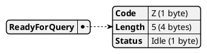


# Packet 10 (1 messages, FrontEnd --> BackEnd)

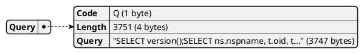


# Packet 11 (145 messages, FrontEnd <-- BackEnd)

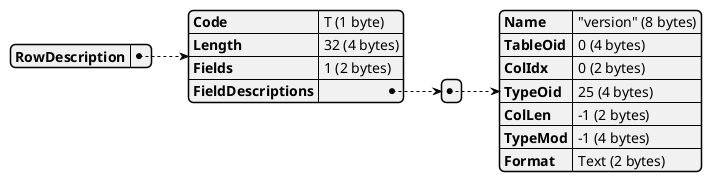

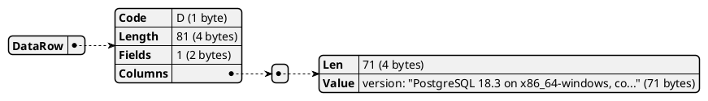

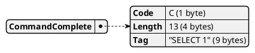

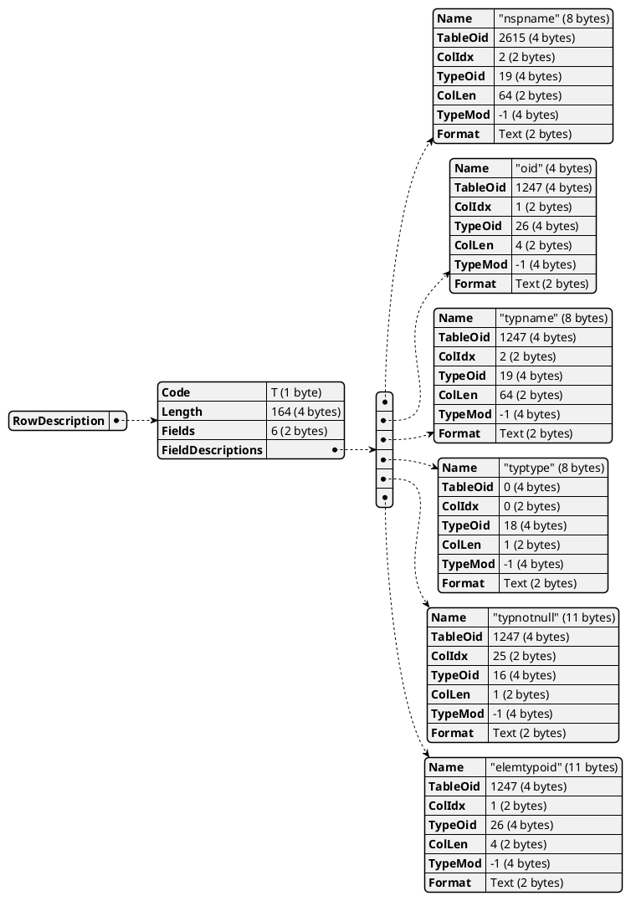

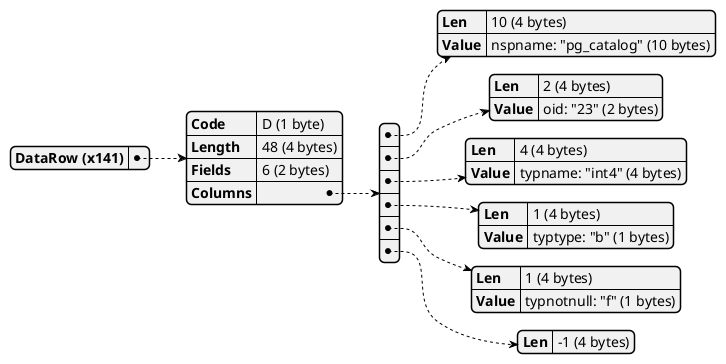


# Packet 12 (46 messages, FrontEnd <-- BackEnd)

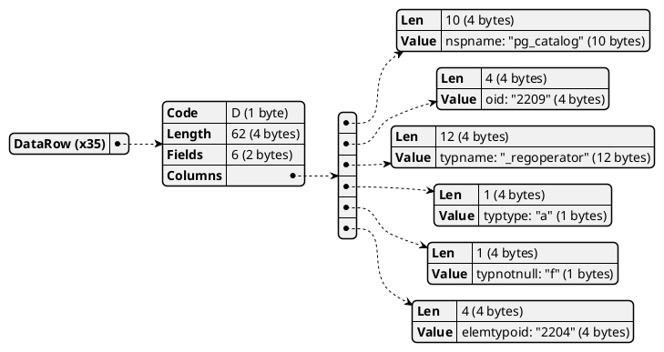

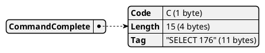

```plantuml
@startjson
{
  "RowDescription": {
    "Code": "T (1 byte)",
    "Length": "81 (4 bytes)",
    "Fields": "3 (2 bytes)",
    "FieldDescriptions": [
      {
        "Name": "\"oid\" (4 bytes)",
        "TableOid": "1247 (4 bytes)",
        "ColIdx": "1 (2 bytes)",
        "TypeOid": "26 (4 bytes)",
        "ColLen": "4 (2 bytes)",
        "TypeMod": "-1 (4 bytes)",
        "Format": "Text (2 bytes)"
      },
      {
        "Name": "\"attname\" (8 bytes)",
        "TableOid": "1249 (4 bytes)",
        "ColIdx": "2 (2 bytes)",
        "TypeOid": "19 (4 bytes)",
        "ColLen": "64 (2 bytes)",
        "TypeMod": "-1 (4 bytes)",
        "Format": "Text (2 bytes)"
      },
      {
        "Name": "\"atttypid\" (9 bytes)",
        "TableOid": "1249 (4 bytes)",
        "ColIdx": "3 (2 bytes)",
        "TypeOid": "26 (4 bytes)",
        "ColLen": "4 (2 bytes)",
        "TypeMod": "-1 (4 bytes)",
        "Format": "Text (2 bytes)"
      }
    ]
  }
}
@endjson
```

```plantuml
@startjson
{
  "CommandComplete": {
    "Code": "C (1 byte)",
    "Length": "13 (4 bytes)",
    "Tag": "\"SELECT 0\" (9 bytes)"
  }
}
@endjson
```

```plantuml
@startjson
{
  "RowDescription": {
    "Code": "T (1 byte)",
    "Length": "56 (4 bytes)",
    "Fields": "2 (2 bytes)",
    "FieldDescriptions": [
      {
        "Name": "\"oid\" (4 bytes)",
        "TableOid": "1247 (4 bytes)",
        "ColIdx": "1 (2 bytes)",
        "TypeOid": "26 (4 bytes)",
        "ColLen": "4 (2 bytes)",
        "TypeMod": "-1 (4 bytes)",
        "Format": "Text (2 bytes)"
      },
      {
        "Name": "\"enumlabel\" (10 bytes)",
        "TableOid": "3501 (4 bytes)",
        "ColIdx": "4 (2 bytes)",
        "TypeOid": "19 (4 bytes)",
        "ColLen": "64 (2 bytes)",
        "TypeMod": "-1 (4 bytes)",
        "Format": "Text (2 bytes)"
      }
    ]
  }
}
@endjson
```

```plantuml
@startjson
{
  "DataRow (x5)": {
    "Code": "D (1 byte)",
    "Length": "22 (4 bytes)",
    "Fields": "2 (2 bytes)",
    "Columns": [
      {
        "Len": "7 (4 bytes)",
        "Value": "oid: \"1469004\" (7 bytes)"
      },
      {
        "Len": "1 (4 bytes)",
        "Value": "enumlabel: \"G\" (1 bytes)"
      }
    ]
  }
}
@endjson
```

```plantuml
@startjson
{
  "CommandComplete": {
    "Code": "C (1 byte)",
    "Length": "13 (4 bytes)",
    "Tag": "\"SELECT 5\" (9 bytes)"
  }
}
@endjson
```

```plantuml
@startjson
{
  "ReadyForQuery": {
    "Code": "Z (1 byte)",
    "Length": "5 (4 bytes)",
    "Status": "Idle (1 byte)"
  }
}
@endjson
```

