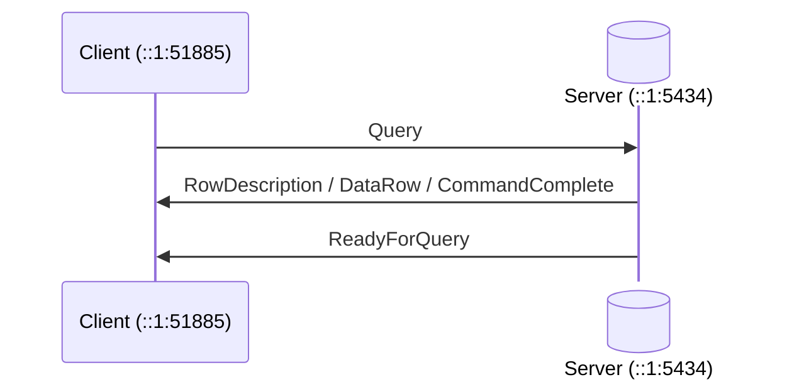

```mermaid
sequenceDiagram
    participant C as Client (::1:51885)
    participant S@{ "type" : "database" } as Server (::1:5434)
    C->>S: Query
    S->>C: RowDescription / DataRow / CommandComplete
    S->>C: ReadyForQuery
```
