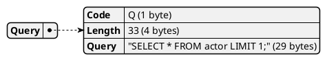
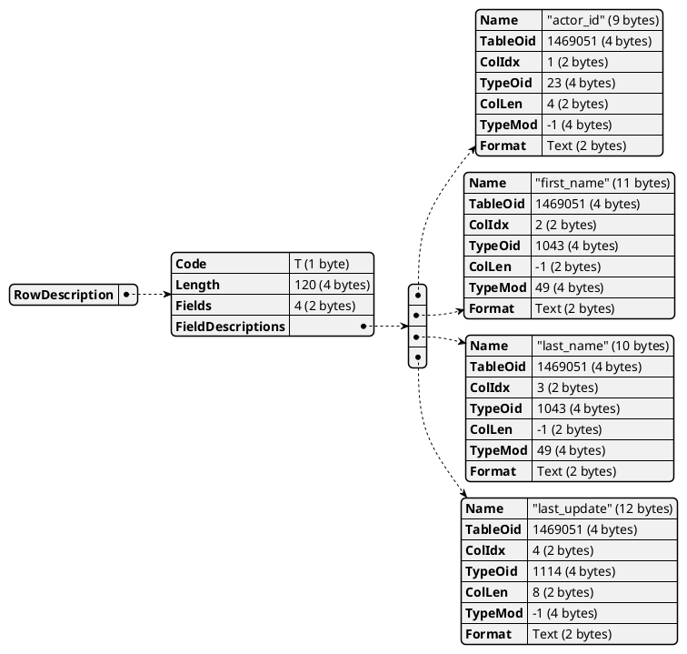
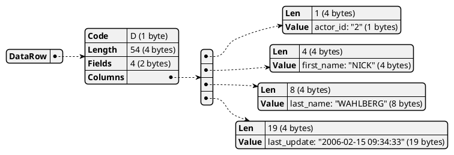
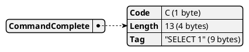
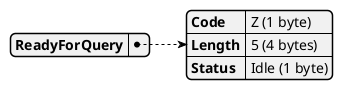

# Packet 1 (1 messages, FrontEnd --> BackEnd)

```plantuml
@startjson
{
  "Query": {
    "Code": "Q (1 byte)",
    "Length": "33 (4 bytes)",
    "Query": "\"SELECT * FROM actor LIMIT 1;\" (29 bytes)"
  }
}
@endjson
```

# Packet 2 (4 messages, FrontEnd <-- BackEnd)

```plantuml
@startjson
{
  "RowDescription": {
    "Code": "T (1 byte)",
    "Length": "120 (4 bytes)",
    "Fields": "4 (2 bytes)",
    "FieldDescriptions": [
      {
        "Name": "\"actor_id\" (9 bytes)",
        "TableOid": "1469051 (4 bytes)",
        "ColIdx": "1 (2 bytes)",
        "TypeOid": "23 (4 bytes)",
        "ColLen": "4 (2 bytes)",
        "TypeMod": "-1 (4 bytes)",
        "Format": "Text (2 bytes)"
      },
      {
        "Name": "\"first_name\" (11 bytes)",
        "TableOid": "1469051 (4 bytes)",
        "ColIdx": "2 (2 bytes)",
        "TypeOid": "1043 (4 bytes)",
        "ColLen": "-1 (2 bytes)",
        "TypeMod": "49 (4 bytes)",
        "Format": "Text (2 bytes)"
      },
      {
        "Name": "\"last_name\" (10 bytes)",
        "TableOid": "1469051 (4 bytes)",
        "ColIdx": "3 (2 bytes)",
        "TypeOid": "1043 (4 bytes)",
        "ColLen": "-1 (2 bytes)",
        "TypeMod": "49 (4 bytes)",
        "Format": "Text (2 bytes)"
      },
      {
        "Name": "\"last_update\" (12 bytes)",
        "TableOid": "1469051 (4 bytes)",
        "ColIdx": "4 (2 bytes)",
        "TypeOid": "1114 (4 bytes)",
        "ColLen": "8 (2 bytes)",
        "TypeMod": "-1 (4 bytes)",
        "Format": "Text (2 bytes)"
      }
    ]
  }
}
@endjson
```

```plantuml
@startjson
{
  "DataRow": {
    "Code": "D (1 byte)",
    "Length": "54 (4 bytes)",
    "Fields": "4 (2 bytes)",
    "Columns": [
      {
        "Len": "1 (4 bytes)",
        "Value": "actor_id: \"2\" (1 bytes)"
      },
      {
        "Len": "4 (4 bytes)",
        "Value": "first_name: \"NICK\" (4 bytes)"
      },
      {
        "Len": "8 (4 bytes)",
        "Value": "last_name: \"WAHLBERG\" (8 bytes)"
      },
      {
        "Len": "19 (4 bytes)",
        "Value": "last_update: \"2006-02-15 09:34:33\" (19 bytes)"
      }
    ]
  }
}
@endjson
```

```plantuml
@startjson
{
  "CommandComplete": {
    "Code": "C (1 byte)",
    "Length": "13 (4 bytes)",
    "Tag": "\"SELECT 1\" (9 bytes)"
  }
}
@endjson
```

```plantuml
@startjson
{
  "ReadyForQuery": {
    "Code": "Z (1 byte)",
    "Length": "5 (4 bytes)",
    "Status": "Idle (1 byte)"
  }
}
@endjson
```

