# Packet 1 (13 messages, FrontEnd --> BackEnd)

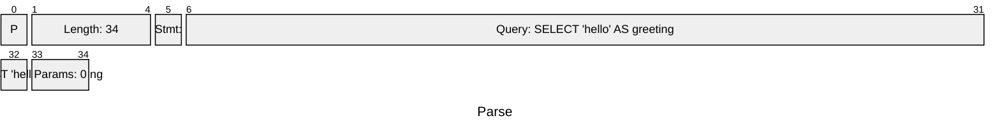

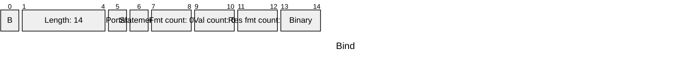

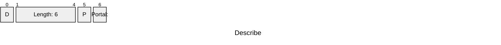

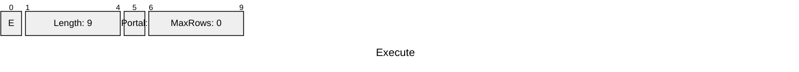

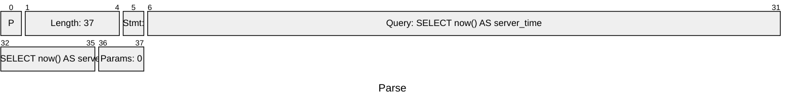


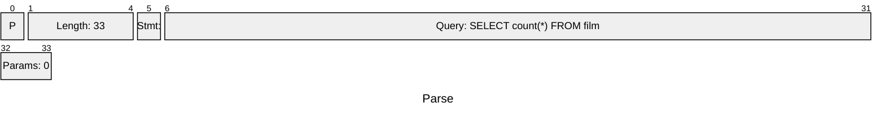


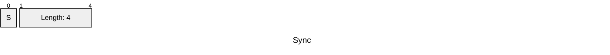


# Packet 2 (16 messages, FrontEnd <-- BackEnd)

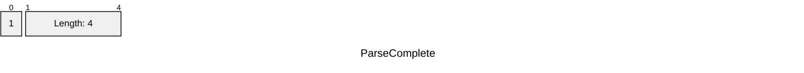


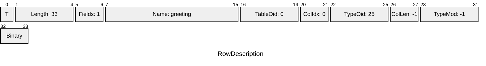

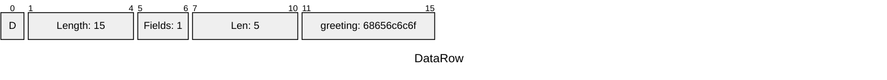

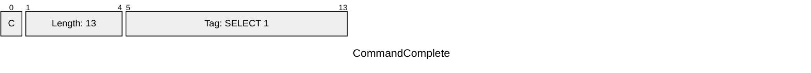


```mermaid
---
title: "RowDescription"
config:
  packet:
    bitsPerRow: 32
---
packet
    +1: "T"
    +4: "Length: 36"
    +2: "Fields: 1"
    +12: "Name: server_time"
    +4: "TableOid: 0"
    +2: "ColIdx: 0"
    +4: "TypeOid: 1184"
    +2: "ColLen: 8"
    +4: "TypeMod: -1"
    +2: "Binary"
```

```mermaid
---
title: "DataRow"
config:
  packet:
    bitsPerRow: 32
---
packet
    +1: "D"
    +4: "Length: 18"
    +2: "Fields: 1"
    +4: "Len: 8"
    +8: "server_time: 0002f54dcfb9d64c"
```

```mermaid
---
title: "CommandComplete"
config:
  packet:
    bitsPerRow: 32
---
packet
    +1: "C"
    +4: "Length: 13"
    +9: "Tag: SELECT 1"
```

```mermaid
---
title: "ParseComplete"
config:
  packet:
    bitsPerRow: 32
---
packet
    +1: "1"
    +4: "Length: 4"
```

```mermaid
---
title: "BindComplete"
config:
  packet:
    bitsPerRow: 32
---
packet
    +1: "2"
    +4: "Length: 4"
```

```mermaid
---
title: "RowDescription"
config:
  packet:
    bitsPerRow: 32
---
packet
    +1: "T"
    +4: "Length: 30"
    +2: "Fields: 1"
    +6: "Name: count"
    +4: "TableOid: 0"
    +2: "ColIdx: 0"
    +4: "TypeOid: 20"
    +2: "ColLen: 8"
    +4: "TypeMod: -1"
    +2: "Binary"
```

```mermaid
---
title: "DataRow"
config:
  packet:
    bitsPerRow: 32
---
packet
    +1: "D"
    +4: "Length: 18"
    +2: "Fields: 1"
    +4: "Len: 8"
    +8: "count: 00000000000003e8"
```

```mermaid
---
title: "CommandComplete"
config:
  packet:
    bitsPerRow: 32
---
packet
    +1: "C"
    +4: "Length: 13"
    +9: "Tag: SELECT 1"
```

```mermaid
---
title: "ReadyForQuery"
config:
  packet:
    bitsPerRow: 32
---
packet
    +1: "Z"
    +4: "Length: 5"
    +1: "Idle"
```

