# Packet 1 (13 messages, FrontEnd --> BackEnd)

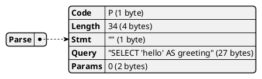

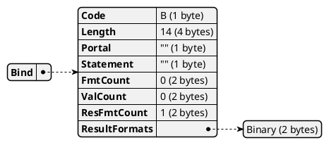

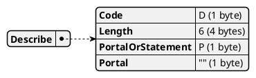

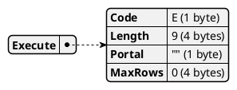

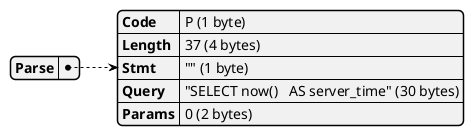


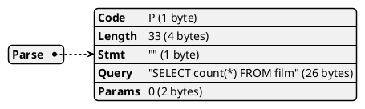


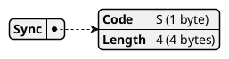


# Packet 2 (16 messages, FrontEnd <-- BackEnd)

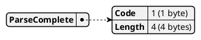


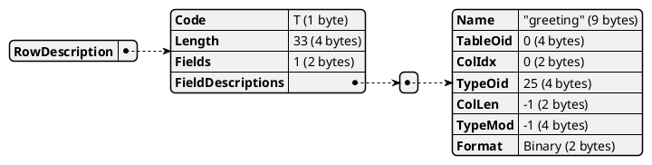

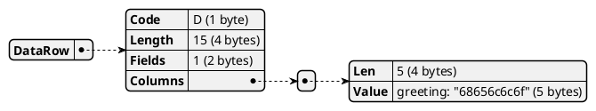

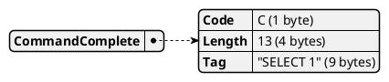


```plantuml
@startjson
{
  "RowDescription": {
    "Code": "T (1 byte)",
    "Length": "36 (4 bytes)",
    "Fields": "1 (2 bytes)",
    "FieldDescriptions": [
      {
        "Name": "\"server_time\" (12 bytes)",
        "TableOid": "0 (4 bytes)",
        "ColIdx": "0 (2 bytes)",
        "TypeOid": "1184 (4 bytes)",
        "ColLen": "8 (2 bytes)",
        "TypeMod": "-1 (4 bytes)",
        "Format": "Binary (2 bytes)"
      }
    ]
  }
}
@endjson
```

```plantuml
@startjson
{
  "DataRow": {
    "Code": "D (1 byte)",
    "Length": "18 (4 bytes)",
    "Fields": "1 (2 bytes)",
    "Columns": [
      {
        "Len": "8 (4 bytes)",
        "Value": "server_time: \"0002f54dcfb9d64c\" (8 bytes)"
      }
    ]
  }
}
@endjson
```

```plantuml
@startjson
{
  "CommandComplete": {
    "Code": "C (1 byte)",
    "Length": "13 (4 bytes)",
    "Tag": "\"SELECT 1\" (9 bytes)"
  }
}
@endjson
```

```plantuml
@startjson
{
  "ParseComplete": {
    "Code": "1 (1 byte)",
    "Length": "4 (4 bytes)"
  }
}
@endjson
```

```plantuml
@startjson
{
  "BindComplete": {
    "Code": "2 (1 byte)",
    "Length": "4 (4 bytes)"
  }
}
@endjson
```

```plantuml
@startjson
{
  "RowDescription": {
    "Code": "T (1 byte)",
    "Length": "30 (4 bytes)",
    "Fields": "1 (2 bytes)",
    "FieldDescriptions": [
      {
        "Name": "\"count\" (6 bytes)",
        "TableOid": "0 (4 bytes)",
        "ColIdx": "0 (2 bytes)",
        "TypeOid": "20 (4 bytes)",
        "ColLen": "8 (2 bytes)",
        "TypeMod": "-1 (4 bytes)",
        "Format": "Binary (2 bytes)"
      }
    ]
  }
}
@endjson
```

```plantuml
@startjson
{
  "DataRow": {
    "Code": "D (1 byte)",
    "Length": "18 (4 bytes)",
    "Fields": "1 (2 bytes)",
    "Columns": [
      {
        "Len": "8 (4 bytes)",
        "Value": "count: \"00000000000003e8\" (8 bytes)"
      }
    ]
  }
}
@endjson
```

```plantuml
@startjson
{
  "CommandComplete": {
    "Code": "C (1 byte)",
    "Length": "13 (4 bytes)",
    "Tag": "\"SELECT 1\" (9 bytes)"
  }
}
@endjson
```

```plantuml
@startjson
{
  "ReadyForQuery": {
    "Code": "Z (1 byte)",
    "Length": "5 (4 bytes)",
    "Status": "Idle (1 byte)"
  }
}
@endjson
```

