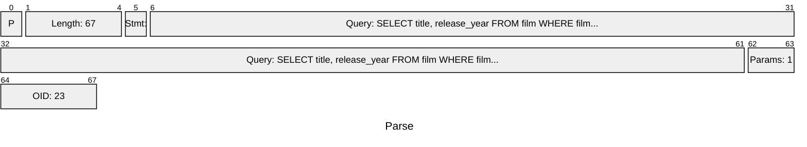
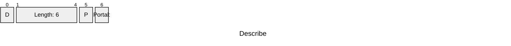
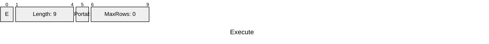
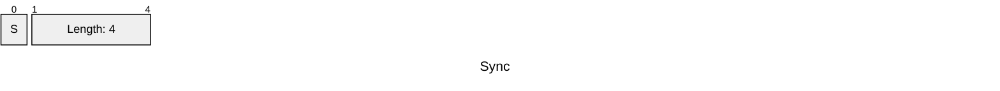
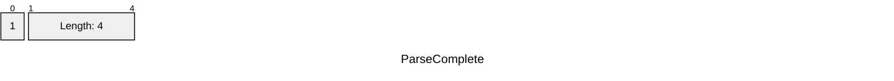
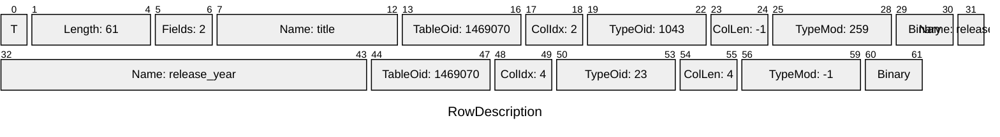
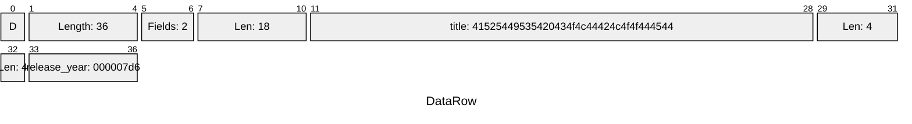
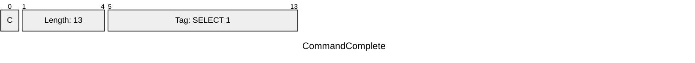

# Packet 1 (5 messages, FrontEnd --> BackEnd)

```mermaid
---
title: "Parse"
config:
  packet:
    bitsPerRow: 32
---
packet
    +1: "P"
    +4: "Length: 67"
    +1: "Stmt: "
    +56: "Query: SELECT title, release_year FROM film WHERE film..."
    +2: "Params: 1"
    +4: "OID: 23"
```

```mermaid
---
title: "Bind"
config:
  packet:
    bitsPerRow: 32
---
packet
    +1: "B"
    +4: "Length: 24"
    +1: "Portal: "
    +1: "Statement: "
    +2: "Fmt count: 1"
    +2: "Binary"
    +2: "Val count: 1"
    +4: "Len: 4"
    +4: "data"
    +2: "Res fmt count: 1"
    +2: "Binary"
```

```mermaid
---
title: "Describe"
config:
  packet:
    bitsPerRow: 32
---
packet
    +1: "D"
    +4: "Length: 6"
    +1: "P"
    +1: "Portal: "
```

```mermaid
---
title: "Execute"
config:
  packet:
    bitsPerRow: 32
---
packet
    +1: "E"
    +4: "Length: 9"
    +1: "Portal: "
    +4: "MaxRows: 0"
```

```mermaid
---
title: "Sync"
config:
  packet:
    bitsPerRow: 32
---
packet
    +1: "S"
    +4: "Length: 4"
```

# Packet 2 (6 messages, FrontEnd <-- BackEnd)

```mermaid
---
title: "ParseComplete"
config:
  packet:
    bitsPerRow: 32
---
packet
    +1: "1"
    +4: "Length: 4"
```

```mermaid
---
title: "BindComplete"
config:
  packet:
    bitsPerRow: 32
---
packet
    +1: "2"
    +4: "Length: 4"
```

```mermaid
---
title: "RowDescription"
config:
  packet:
    bitsPerRow: 32
---
packet
    +1: "T"
    +4: "Length: 61"
    +2: "Fields: 2"
    +6: "Name: title"
    +4: "TableOid: 1469070"
    +2: "ColIdx: 2"
    +4: "TypeOid: 1043"
    +2: "ColLen: -1"
    +4: "TypeMod: 259"
    +2: "Binary"
    +13: "Name: release_year"
    +4: "TableOid: 1469070"
    +2: "ColIdx: 4"
    +4: "TypeOid: 23"
    +2: "ColLen: 4"
    +4: "TypeMod: -1"
    +2: "Binary"
```

```mermaid
---
title: "DataRow"
config:
  packet:
    bitsPerRow: 32
---
packet
    +1: "D"
    +4: "Length: 36"
    +2: "Fields: 2"
    +4: "Len: 18"
    +18: "title: 41525449535420434f4c44424c4f4f444544"
    +4: "Len: 4"
    +4: "release_year: 000007d6"
```

```mermaid
---
title: "CommandComplete"
config:
  packet:
    bitsPerRow: 32
---
packet
    +1: "C"
    +4: "Length: 13"
    +9: "Tag: SELECT 1"
```

```mermaid
---
title: "ReadyForQuery"
config:
  packet:
    bitsPerRow: 32
---
packet
    +1: "Z"
    +4: "Length: 5"
    +1: "Idle"
```

