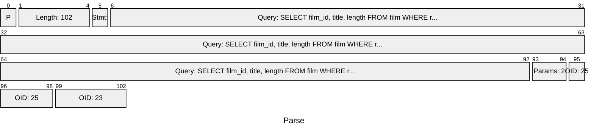
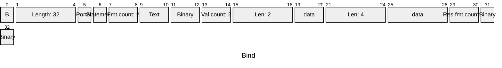
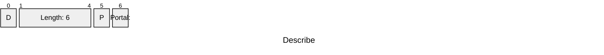
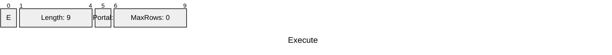
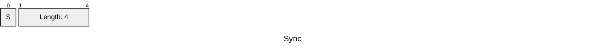
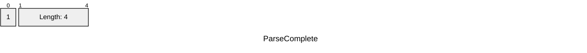
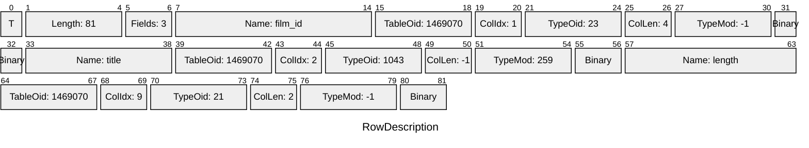
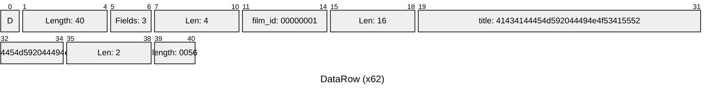
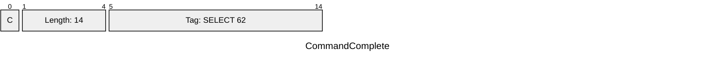
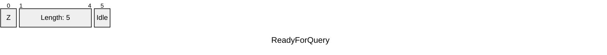

# Packet 1 (5 messages, FrontEnd --> BackEnd)

```mermaid
---
title: "Parse"
config:
  packet:
    bitsPerRow: 32
---
packet
    +1: "P"
    +4: "Length: 102"
    +1: "Stmt: "
    +87: "Query: SELECT film_id, title, length FROM film WHERE r..."
    +2: "Params: 2"
    +4: "OID: 25"
    +4: "OID: 23"
```

```mermaid
---
title: "Bind"
config:
  packet:
    bitsPerRow: 32
---
packet
    +1: "B"
    +4: "Length: 32"
    +1: "Portal: "
    +1: "Statement: "
    +2: "Fmt count: 2"
    +2: "Text"
    +2: "Binary"
    +2: "Val count: 2"
    +4: "Len: 2"
    +2: "data"
    +4: "Len: 4"
    +4: "data"
    +2: "Res fmt count: 1"
    +2: "Binary"
```

```mermaid
---
title: "Describe"
config:
  packet:
    bitsPerRow: 32
---
packet
    +1: "D"
    +4: "Length: 6"
    +1: "P"
    +1: "Portal: "
```

```mermaid
---
title: "Execute"
config:
  packet:
    bitsPerRow: 32
---
packet
    +1: "E"
    +4: "Length: 9"
    +1: "Portal: "
    +4: "MaxRows: 0"
```

```mermaid
---
title: "Sync"
config:
  packet:
    bitsPerRow: 32
---
packet
    +1: "S"
    +4: "Length: 4"
```

# Packet 2 (67 messages, FrontEnd <-- BackEnd)

```mermaid
---
title: "ParseComplete"
config:
  packet:
    bitsPerRow: 32
---
packet
    +1: "1"
    +4: "Length: 4"
```

```mermaid
---
title: "BindComplete"
config:
  packet:
    bitsPerRow: 32
---
packet
    +1: "2"
    +4: "Length: 4"
```

```mermaid
---
title: "RowDescription"
config:
  packet:
    bitsPerRow: 32
---
packet
    +1: "T"
    +4: "Length: 81"
    +2: "Fields: 3"
    +8: "Name: film_id"
    +4: "TableOid: 1469070"
    +2: "ColIdx: 1"
    +4: "TypeOid: 23"
    +2: "ColLen: 4"
    +4: "TypeMod: -1"
    +2: "Binary"
    +6: "Name: title"
    +4: "TableOid: 1469070"
    +2: "ColIdx: 2"
    +4: "TypeOid: 1043"
    +2: "ColLen: -1"
    +4: "TypeMod: 259"
    +2: "Binary"
    +7: "Name: length"
    +4: "TableOid: 1469070"
    +2: "ColIdx: 9"
    +4: "TypeOid: 21"
    +2: "ColLen: 2"
    +4: "TypeMod: -1"
    +2: "Binary"
```

```mermaid
---
title: "DataRow (x62)"
config:
  packet:
    bitsPerRow: 32
---
packet
    +1: "D"
    +4: "Length: 40"
    +2: "Fields: 3"
    +4: "Len: 4"
    +4: "film_id: 00000001"
    +4: "Len: 16"
    +16: "title: 41434144454d592044494e4f53415552"
    +4: "Len: 2"
    +2: "length: 0056"
```

```mermaid
---
title: "CommandComplete"
config:
  packet:
    bitsPerRow: 32
---
packet
    +1: "C"
    +4: "Length: 14"
    +10: "Tag: SELECT 62"
```

```mermaid
---
title: "ReadyForQuery"
config:
  packet:
    bitsPerRow: 32
---
packet
    +1: "Z"
    +4: "Length: 5"
    +1: "Idle"
```

