# Packet 1 (3 messages, FrontEnd --> BackEnd)

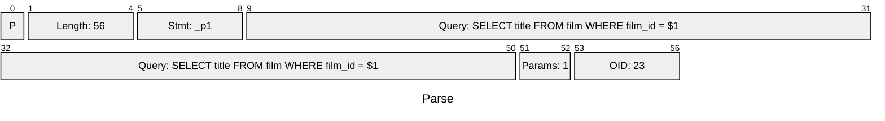

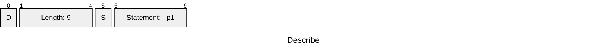

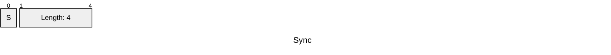


# Packet 2 (4 messages, FrontEnd <-- BackEnd)


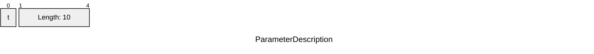

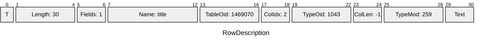

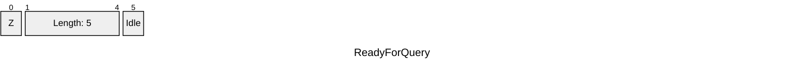


# Packet 3 (3 messages, FrontEnd --> BackEnd)

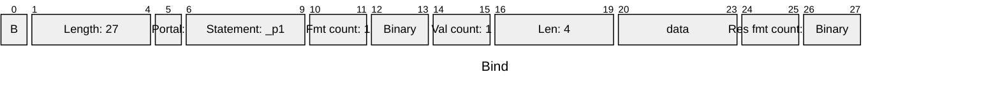

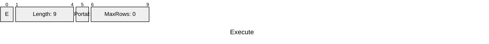


# Packet 4 (4 messages, FrontEnd <-- BackEnd)


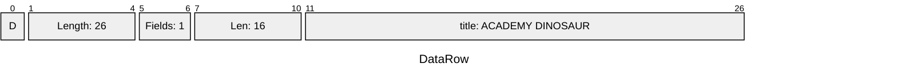

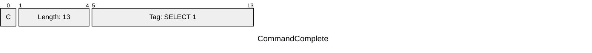


# Packet 5 (3 messages, FrontEnd --> BackEnd)


# Packet 6 (4 messages, FrontEnd <-- BackEnd)


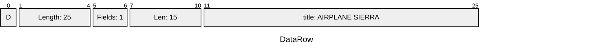


```mermaid
---
title: "ReadyForQuery"
config:
  packet:
    bitsPerRow: 32
---
packet
    +1: "Z"
    +4: "Length: 5"
    +1: "Idle"
```


# Packet 7 (3 messages, FrontEnd --> BackEnd)

```mermaid
---
title: "Bind"
config:
  packet:
    bitsPerRow: 32
---
packet
    +1: "B"
    +4: "Length: 27"
    +1: "Portal: "
    +4: "Statement: _p1"
    +2: "Fmt count: 1"
    +2: "Binary"
    +2: "Val count: 1"
    +4: "Len: 4"
    +4: "data"
    +2: "Res fmt count: 1"
    +2: "Binary"
```

```mermaid
---
title: "Execute"
config:
  packet:
    bitsPerRow: 32
---
packet
    +1: "E"
    +4: "Length: 9"
    +1: "Portal: "
    +4: "MaxRows: 0"
```

```mermaid
---
title: "Sync"
config:
  packet:
    bitsPerRow: 32
---
packet
    +1: "S"
    +4: "Length: 4"
```


# Packet 8 (4 messages, FrontEnd <-- BackEnd)

```mermaid
---
title: "BindComplete"
config:
  packet:
    bitsPerRow: 32
---
packet
    +1: "2"
    +4: "Length: 4"
```

```mermaid
---
title: "DataRow"
config:
  packet:
    bitsPerRow: 32
---
packet
    +1: "D"
    +4: "Length: 21"
    +2: "Fields: 1"
    +4: "Len: 11"
    +11: "title: ALI FOREVER"
```

```mermaid
---
title: "CommandComplete"
config:
  packet:
    bitsPerRow: 32
---
packet
    +1: "C"
    +4: "Length: 13"
    +9: "Tag: SELECT 1"
```

```mermaid
---
title: "ReadyForQuery"
config:
  packet:
    bitsPerRow: 32
---
packet
    +1: "Z"
    +4: "Length: 5"
    +1: "Idle"
```

