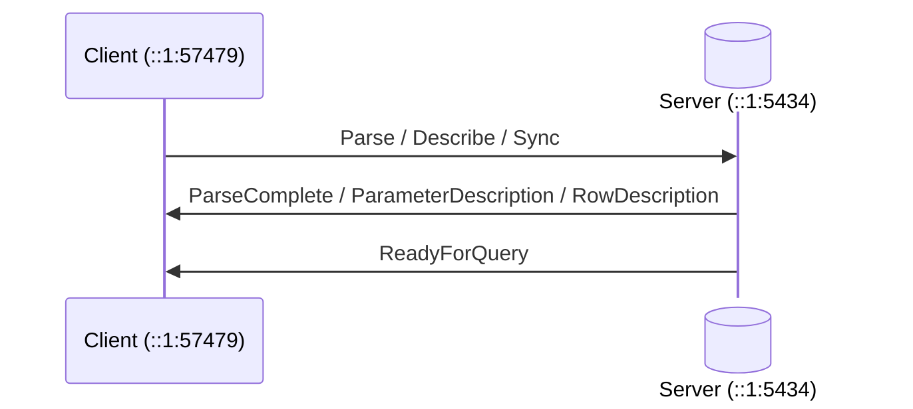
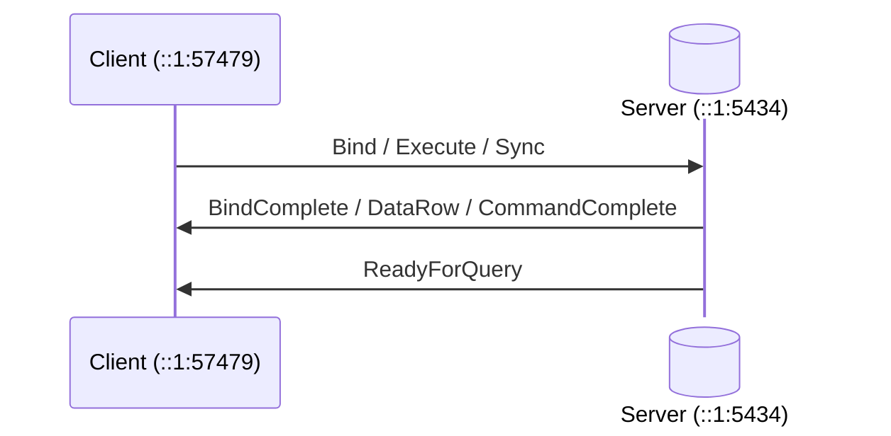

```mermaid
sequenceDiagram
    participant C as Client (::1:57479)
    participant S@{ "type" : "database" } as Server (::1:5434)
    C->>S: Parse / Describe / Sync
    S->>C: ParseComplete / ParameterDescription / RowDescription
    S->>C: ReadyForQuery
```

```mermaid
sequenceDiagram
    participant C as Client (::1:57479)
    participant S@{ "type" : "database" } as Server (::1:5434)
    C->>S: Bind / Execute / Sync
    S->>C: BindComplete / DataRow / CommandComplete
    S->>C: ReadyForQuery
```

```mermaid
sequenceDiagram
    participant C as Client (::1:57479)
    participant S@{ "type" : "database" } as Server (::1:5434)
    C->>S: Bind / Execute / Sync
    S->>C: BindComplete / DataRow / CommandComplete
    S->>C: ReadyForQuery
```

```mermaid
sequenceDiagram
    participant C as Client (::1:57479)
    participant S@{ "type" : "database" } as Server (::1:5434)
    C->>S: Bind / Execute / Sync
    S->>C: BindComplete / DataRow / CommandComplete
    S->>C: ReadyForQuery
```
