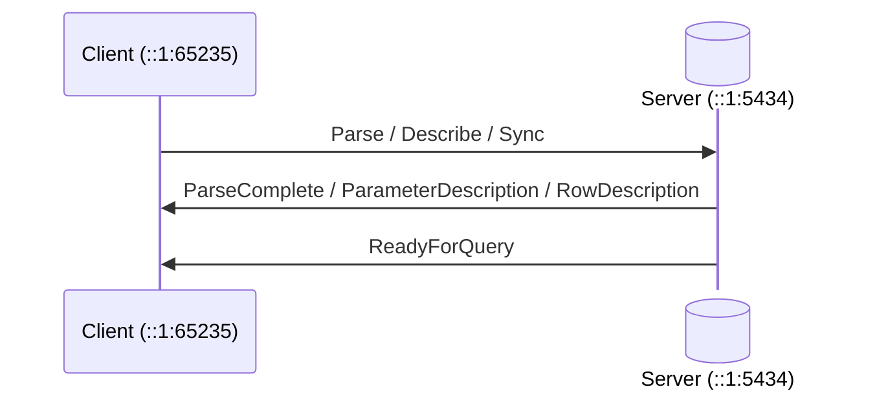
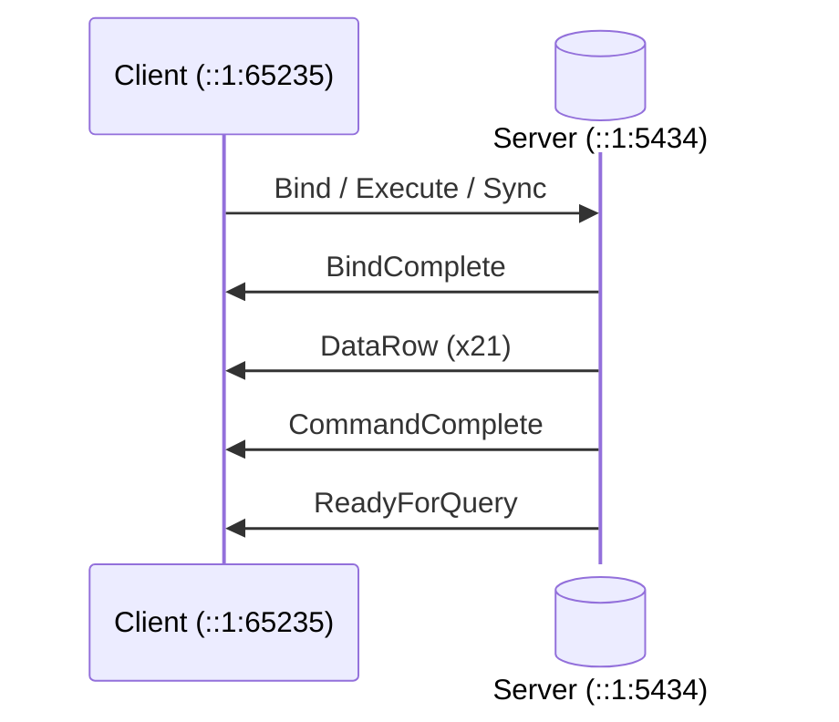
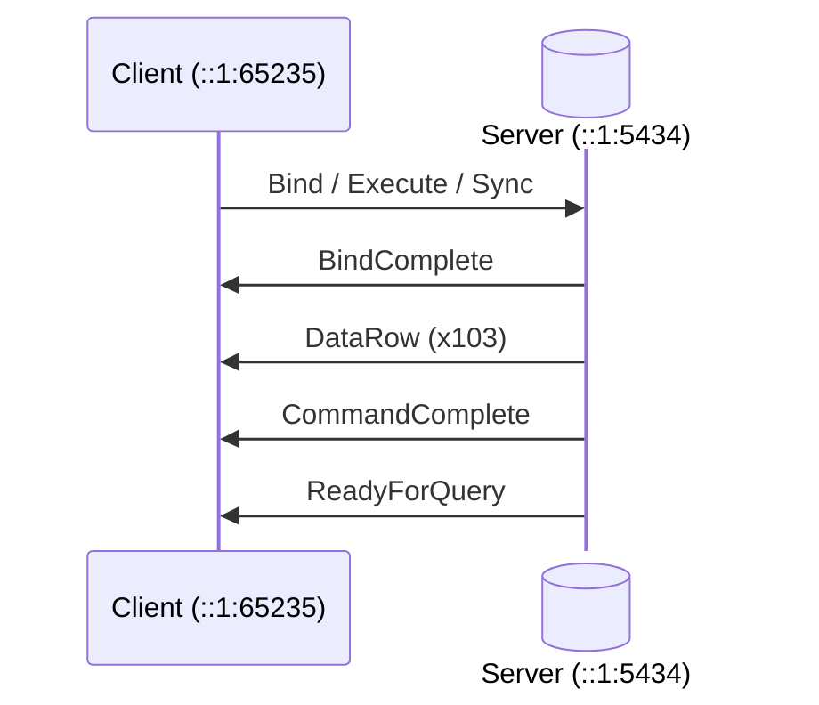

```mermaid
sequenceDiagram
    participant C as Client (::1:65235)
    participant S@{ "type" : "database" } as Server (::1:5434)
    C->>S: Parse / Describe / Sync
    S->>C: ParseComplete / ParameterDescription / RowDescription
    S->>C: ReadyForQuery
```

```mermaid
sequenceDiagram
    participant C as Client (::1:65235)
    participant S@{ "type" : "database" } as Server (::1:5434)
    C->>S: Bind / Execute / Sync
    S->>C: BindComplete
    S->>C: DataRow (x21)
    S->>C: CommandComplete
    S->>C: ReadyForQuery
```

```mermaid
sequenceDiagram
    participant C as Client (::1:65235)
    participant S@{ "type" : "database" } as Server (::1:5434)
    C->>S: Bind / Execute / Sync
    S->>C: BindComplete
    S->>C: DataRow (x62)
    S->>C: CommandComplete
    S->>C: ReadyForQuery
```

```mermaid
sequenceDiagram
    participant C as Client (::1:65235)
    participant S@{ "type" : "database" } as Server (::1:5434)
    C->>S: Bind / Execute / Sync
    S->>C: BindComplete
    S->>C: DataRow (x103)
    S->>C: CommandComplete
    S->>C: ReadyForQuery
```
