# Packet 1 (3 messages, FrontEnd --> BackEnd)

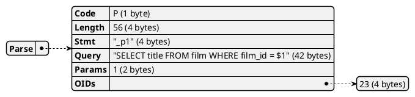

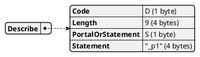

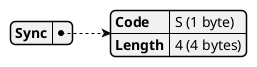


# Packet 2 (4 messages, FrontEnd <-- BackEnd)

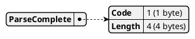

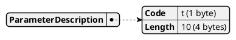

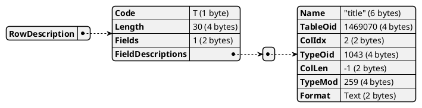

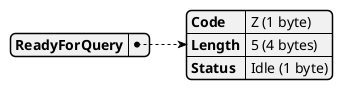


# Packet 3 (3 messages, FrontEnd --> BackEnd)

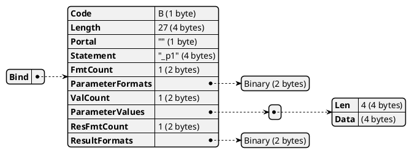

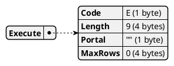


# Packet 4 (4 messages, FrontEnd <-- BackEnd)


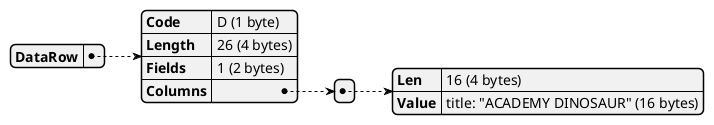

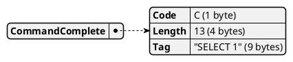


# Packet 5 (3 messages, FrontEnd --> BackEnd)


# Packet 6 (4 messages, FrontEnd <-- BackEnd)


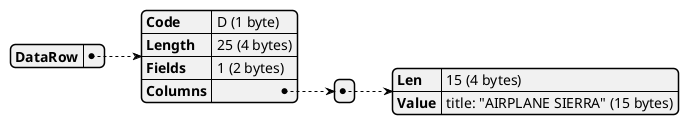


```plantuml
@startjson
{
  "ReadyForQuery": {
    "Code": "Z (1 byte)",
    "Length": "5 (4 bytes)",
    "Status": "Idle (1 byte)"
  }
}
@endjson
```


# Packet 7 (3 messages, FrontEnd --> BackEnd)

```plantuml
@startjson
{
  "Bind": {
    "Code": "B (1 byte)",
    "Length": "27 (4 bytes)",
    "Portal": "\"\" (1 byte)",
    "Statement": "\"_p1\" (4 bytes)",
    "FmtCount": "1 (2 bytes)",
    "ParameterFormats": [
      "Binary (2 bytes)"
    ],
    "ValCount": "1 (2 bytes)",
    "ParameterValues": [
      {
        "Len": "4 (4 bytes)",
        "Data": "(4 bytes)"
      }
    ],
    "ResFmtCount": "1 (2 bytes)",
    "ResultFormats": [
      "Binary (2 bytes)"
    ]
  }
}
@endjson
```

```plantuml
@startjson
{
  "Execute": {
    "Code": "E (1 byte)",
    "Length": "9 (4 bytes)",
    "Portal": "\"\" (1 byte)",
    "MaxRows": "0 (4 bytes)"
  }
}
@endjson
```

```plantuml
@startjson
{
  "Sync": {
    "Code": "S (1 byte)",
    "Length": "4 (4 bytes)"
  }
}
@endjson
```


# Packet 8 (4 messages, FrontEnd <-- BackEnd)

```plantuml
@startjson
{
  "BindComplete": {
    "Code": "2 (1 byte)",
    "Length": "4 (4 bytes)"
  }
}
@endjson
```

```plantuml
@startjson
{
  "DataRow": {
    "Code": "D (1 byte)",
    "Length": "21 (4 bytes)",
    "Fields": "1 (2 bytes)",
    "Columns": [
      {
        "Len": "11 (4 bytes)",
        "Value": "title: \"ALI FOREVER\" (11 bytes)"
      }
    ]
  }
}
@endjson
```

```plantuml
@startjson
{
  "CommandComplete": {
    "Code": "C (1 byte)",
    "Length": "13 (4 bytes)",
    "Tag": "\"SELECT 1\" (9 bytes)"
  }
}
@endjson
```

```plantuml
@startjson
{
  "ReadyForQuery": {
    "Code": "Z (1 byte)",
    "Length": "5 (4 bytes)",
    "Status": "Idle (1 byte)"
  }
}
@endjson
```

