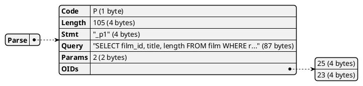
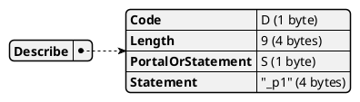
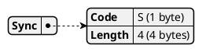
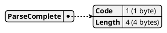
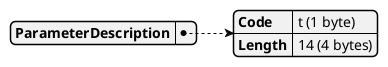
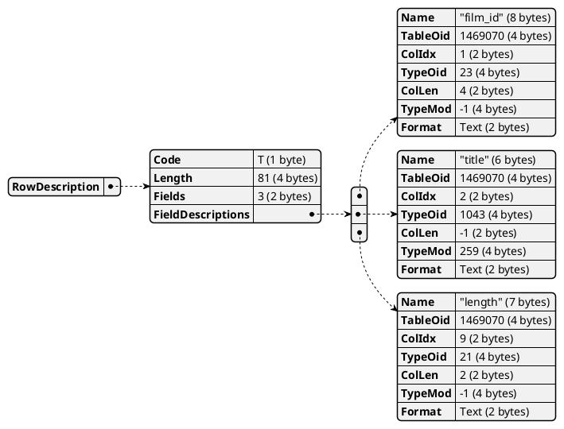
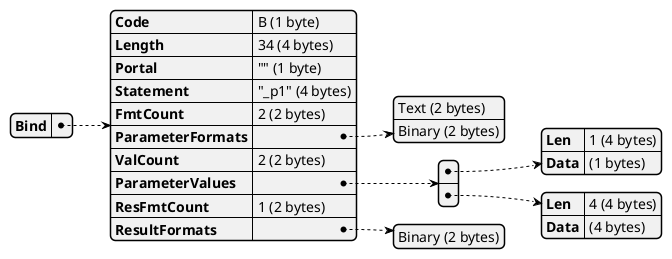
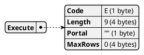
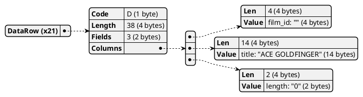
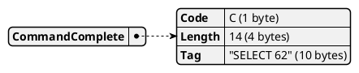

# Packet 1 (3 messages, FrontEnd --> BackEnd)

```plantuml
@startjson
{
  "Parse": {
    "Code": "P (1 byte)",
    "Length": "105 (4 bytes)",
    "Stmt": "\"_p1\" (4 bytes)",
    "Query": "\"SELECT film_id, title, length FROM film WHERE r...\" (87 bytes)",
    "Params": "2 (2 bytes)",
    "OIDs": [
      "25 (4 bytes)",
      "23 (4 bytes)"
    ]
  }
}
@endjson
```

```plantuml
@startjson
{
  "Describe": {
    "Code": "D (1 byte)",
    "Length": "9 (4 bytes)",
    "PortalOrStatement": "S (1 byte)",
    "Statement": "\"_p1\" (4 bytes)"
  }
}
@endjson
```

```plantuml
@startjson
{
  "Sync": {
    "Code": "S (1 byte)",
    "Length": "4 (4 bytes)"
  }
}
@endjson
```

# Packet 2 (4 messages, FrontEnd <-- BackEnd)

```plantuml
@startjson
{
  "ParseComplete": {
    "Code": "1 (1 byte)",
    "Length": "4 (4 bytes)"
  }
}
@endjson
```

```plantuml
@startjson
{
  "ParameterDescription": {
    "Code": "t (1 byte)",
    "Length": "14 (4 bytes)"
  }
}
@endjson
```

```plantuml
@startjson
{
  "RowDescription": {
    "Code": "T (1 byte)",
    "Length": "81 (4 bytes)",
    "Fields": "3 (2 bytes)",
    "FieldDescriptions": [
      {
        "Name": "\"film_id\" (8 bytes)",
        "TableOid": "1469070 (4 bytes)",
        "ColIdx": "1 (2 bytes)",
        "TypeOid": "23 (4 bytes)",
        "ColLen": "4 (2 bytes)",
        "TypeMod": "-1 (4 bytes)",
        "Format": "Text (2 bytes)"
      },
      {
        "Name": "\"title\" (6 bytes)",
        "TableOid": "1469070 (4 bytes)",
        "ColIdx": "2 (2 bytes)",
        "TypeOid": "1043 (4 bytes)",
        "ColLen": "-1 (2 bytes)",
        "TypeMod": "259 (4 bytes)",
        "Format": "Text (2 bytes)"
      },
      {
        "Name": "\"length\" (7 bytes)",
        "TableOid": "1469070 (4 bytes)",
        "ColIdx": "9 (2 bytes)",
        "TypeOid": "21 (4 bytes)",
        "ColLen": "2 (2 bytes)",
        "TypeMod": "-1 (4 bytes)",
        "Format": "Text (2 bytes)"
      }
    ]
  }
}
@endjson
```

```plantuml
@startjson
{
  "ReadyForQuery": {
    "Code": "Z (1 byte)",
    "Length": "5 (4 bytes)",
    "Status": "Idle (1 byte)"
  }
}
@endjson
```

# Packet 3 (3 messages, FrontEnd --> BackEnd)

```plantuml
@startjson
{
  "Bind": {
    "Code": "B (1 byte)",
    "Length": "34 (4 bytes)",
    "Portal": "\"\" (1 byte)",
    "Statement": "\"_p1\" (4 bytes)",
    "FmtCount": "2 (2 bytes)",
    "ParameterFormats": [
      "Text (2 bytes)",
      "Binary (2 bytes)"
    ],
    "ValCount": "2 (2 bytes)",
    "ParameterValues": [
      {
        "Len": "1 (4 bytes)",
        "Data": "(1 bytes)"
      },
      {
        "Len": "4 (4 bytes)",
        "Data": "(4 bytes)"
      }
    ],
    "ResFmtCount": "1 (2 bytes)",
    "ResultFormats": [
      "Binary (2 bytes)"
    ]
  }
}
@endjson
```

```plantuml
@startjson
{
  "Execute": {
    "Code": "E (1 byte)",
    "Length": "9 (4 bytes)",
    "Portal": "\"\" (1 byte)",
    "MaxRows": "0 (4 bytes)"
  }
}
@endjson
```

```plantuml
@startjson
{
  "Sync": {
    "Code": "S (1 byte)",
    "Length": "4 (4 bytes)"
  }
}
@endjson
```

# Packet 4 (24 messages, FrontEnd <-- BackEnd)

```plantuml
@startjson
{
  "BindComplete": {
    "Code": "2 (1 byte)",
    "Length": "4 (4 bytes)"
  }
}
@endjson
```

```plantuml
@startjson
{
  "DataRow (x21)": {
    "Code": "D (1 byte)",
    "Length": "38 (4 bytes)",
    "Fields": "3 (2 bytes)",
    "Columns": [
      {
        "Len": "4 (4 bytes)",
        "Value": "film_id: \"\u0000\u0000\u0000\u0002\" (4 bytes)"
      },
      {
        "Len": "14 (4 bytes)",
        "Value": "title: \"ACE GOLDFINGER\" (14 bytes)"
      },
      {
        "Len": "2 (4 bytes)",
        "Value": "length: \"\u00000\" (2 bytes)"
      }
    ]
  }
}
@endjson
```

```plantuml
@startjson
{
  "CommandComplete": {
    "Code": "C (1 byte)",
    "Length": "14 (4 bytes)",
    "Tag": "\"SELECT 21\" (10 bytes)"
  }
}
@endjson
```

```plantuml
@startjson
{
  "ReadyForQuery": {
    "Code": "Z (1 byte)",
    "Length": "5 (4 bytes)",
    "Status": "Idle (1 byte)"
  }
}
@endjson
```

# Packet 5 (3 messages, FrontEnd --> BackEnd)

```plantuml
@startjson
{
  "Bind": {
    "Code": "B (1 byte)",
    "Length": "35 (4 bytes)",
    "Portal": "\"\" (1 byte)",
    "Statement": "\"_p1\" (4 bytes)",
    "FmtCount": "2 (2 bytes)",
    "ParameterFormats": [
      "Text (2 bytes)",
      "Binary (2 bytes)"
    ],
    "ValCount": "2 (2 bytes)",
    "ParameterValues": [
      {
        "Len": "2 (4 bytes)",
        "Data": "(2 bytes)"
      },
      {
        "Len": "4 (4 bytes)",
        "Data": "(4 bytes)"
      }
    ],
    "ResFmtCount": "1 (2 bytes)",
    "ResultFormats": [
      "Binary (2 bytes)"
    ]
  }
}
@endjson
```

```plantuml
@startjson
{
  "Execute": {
    "Code": "E (1 byte)",
    "Length": "9 (4 bytes)",
    "Portal": "\"\" (1 byte)",
    "MaxRows": "0 (4 bytes)"
  }
}
@endjson
```

```plantuml
@startjson
{
  "Sync": {
    "Code": "S (1 byte)",
    "Length": "4 (4 bytes)"
  }
}
@endjson
```

# Packet 6 (65 messages, FrontEnd <-- BackEnd)

```plantuml
@startjson
{
  "BindComplete": {
    "Code": "2 (1 byte)",
    "Length": "4 (4 bytes)"
  }
}
@endjson
```

```plantuml
@startjson
{
  "DataRow (x62)": {
    "Code": "D (1 byte)",
    "Length": "40 (4 bytes)",
    "Fields": "3 (2 bytes)",
    "Columns": [
      {
        "Len": "4 (4 bytes)",
        "Value": "film_id: \"\u0000\u0000\u0000\u0001\" (4 bytes)"
      },
      {
        "Len": "16 (4 bytes)",
        "Value": "title: \"ACADEMY DINOSAUR\" (16 bytes)"
      },
      {
        "Len": "2 (4 bytes)",
        "Value": "length: \"\u0000V\" (2 bytes)"
      }
    ]
  }
}
@endjson
```

```plantuml
@startjson
{
  "CommandComplete": {
    "Code": "C (1 byte)",
    "Length": "14 (4 bytes)",
    "Tag": "\"SELECT 62\" (10 bytes)"
  }
}
@endjson
```

```plantuml
@startjson
{
  "ReadyForQuery": {
    "Code": "Z (1 byte)",
    "Length": "5 (4 bytes)",
    "Status": "Idle (1 byte)"
  }
}
@endjson
```

# Packet 7 (3 messages, FrontEnd --> BackEnd)

```plantuml
@startjson
{
  "Bind": {
    "Code": "B (1 byte)",
    "Length": "34 (4 bytes)",
    "Portal": "\"\" (1 byte)",
    "Statement": "\"_p1\" (4 bytes)",
    "FmtCount": "2 (2 bytes)",
    "ParameterFormats": [
      "Text (2 bytes)",
      "Binary (2 bytes)"
    ],
    "ValCount": "2 (2 bytes)",
    "ParameterValues": [
      {
        "Len": "1 (4 bytes)",
        "Data": "(1 bytes)"
      },
      {
        "Len": "4 (4 bytes)",
        "Data": "(4 bytes)"
      }
    ],
    "ResFmtCount": "1 (2 bytes)",
    "ResultFormats": [
      "Binary (2 bytes)"
    ]
  }
}
@endjson
```

```plantuml
@startjson
{
  "Execute": {
    "Code": "E (1 byte)",
    "Length": "9 (4 bytes)",
    "Portal": "\"\" (1 byte)",
    "MaxRows": "0 (4 bytes)"
  }
}
@endjson
```

```plantuml
@startjson
{
  "Sync": {
    "Code": "S (1 byte)",
    "Length": "4 (4 bytes)"
  }
}
@endjson
```

# Packet 8 (106 messages, FrontEnd <-- BackEnd)

```plantuml
@startjson
{
  "BindComplete": {
    "Code": "2 (1 byte)",
    "Length": "4 (4 bytes)"
  }
}
@endjson
```

```plantuml
@startjson
{
  "DataRow (x103)": {
    "Code": "D (1 byte)",
    "Length": "39 (4 bytes)",
    "Fields": "3 (2 bytes)",
    "Columns": [
      {
        "Len": "4 (4 bytes)",
        "Value": "film_id: \"\u0000\u0000\u0000\b\" (4 bytes)"
      },
      {
        "Len": "15 (4 bytes)",
        "Value": "title: \"AIRPORT POLLOCK\" (15 bytes)"
      },
      {
        "Len": "2 (4 bytes)",
        "Value": "length: \"\u00006\" (2 bytes)"
      }
    ]
  }
}
@endjson
```

```plantuml
@startjson
{
  "CommandComplete": {
    "Code": "C (1 byte)",
    "Length": "15 (4 bytes)",
    "Tag": "\"SELECT 103\" (11 bytes)"
  }
}
@endjson
```

```plantuml
@startjson
{
  "ReadyForQuery": {
    "Code": "Z (1 byte)",
    "Length": "5 (4 bytes)",
    "Status": "Idle (1 byte)"
  }
}
@endjson
```

