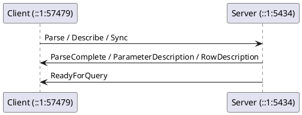
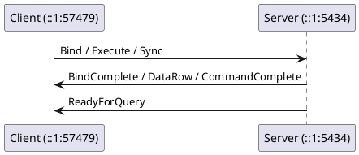

```plantuml
@startuml
participant "Client (::1:57479)" as C
participant "Server (::1:5434)" as S
C -> S : Parse / Describe / Sync
S -> C : ParseComplete / ParameterDescription / RowDescription
S -> C : ReadyForQuery
@enduml
```

```plantuml
@startuml
participant "Client (::1:57479)" as C
participant "Server (::1:5434)" as S
C -> S : Bind / Execute / Sync
S -> C : BindComplete / DataRow / CommandComplete
S -> C : ReadyForQuery
@enduml
```

```plantuml
@startuml
participant "Client (::1:57479)" as C
participant "Server (::1:5434)" as S
C -> S : Bind / Execute / Sync
S -> C : BindComplete / DataRow / CommandComplete
S -> C : ReadyForQuery
@enduml
```

```plantuml
@startuml
participant "Client (::1:57479)" as C
participant "Server (::1:5434)" as S
C -> S : Bind / Execute / Sync
S -> C : BindComplete / DataRow / CommandComplete
S -> C : ReadyForQuery
@enduml
```
