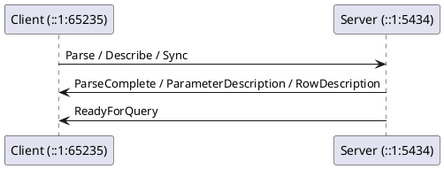
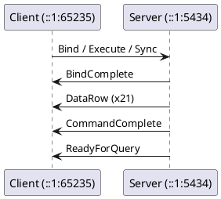
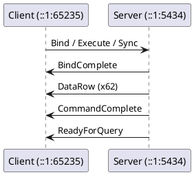
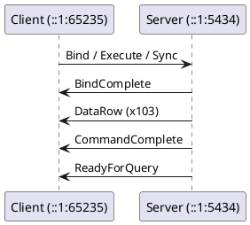

```plantuml
@startuml
participant "Client (::1:65235)" as C
participant "Server (::1:5434)" as S
C -> S : Parse / Describe / Sync
S -> C : ParseComplete / ParameterDescription / RowDescription
S -> C : ReadyForQuery
@enduml
```

```plantuml
@startuml
participant "Client (::1:65235)" as C
participant "Server (::1:5434)" as S
C -> S : Bind / Execute / Sync
S -> C : BindComplete
S -> C : DataRow (x21)
S -> C : CommandComplete
S -> C : ReadyForQuery
@enduml
```

```plantuml
@startuml
participant "Client (::1:65235)" as C
participant "Server (::1:5434)" as S
C -> S : Bind / Execute / Sync
S -> C : BindComplete
S -> C : DataRow (x62)
S -> C : CommandComplete
S -> C : ReadyForQuery
@enduml
```

```plantuml
@startuml
participant "Client (::1:65235)" as C
participant "Server (::1:5434)" as S
C -> S : Bind / Execute / Sync
S -> C : BindComplete
S -> C : DataRow (x103)
S -> C : CommandComplete
S -> C : ReadyForQuery
@enduml
```
