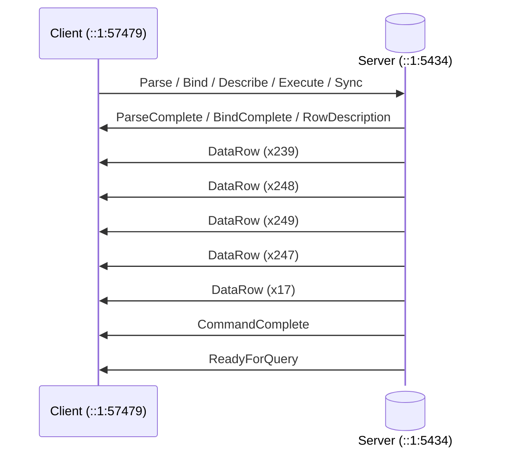

```mermaid
sequenceDiagram
    participant C as Client (::1:57479)
    participant S@{ "type" : "database" } as Server (::1:5434)
    C->>S: Parse / Bind / Describe / Execute / Sync
    S->>C: ParseComplete / BindComplete / RowDescription
    S->>C: DataRow (x239)
    S->>C: DataRow (x248)
    S->>C: DataRow (x249)
    S->>C: DataRow (x247)
    S->>C: DataRow (x17)
    S->>C: CommandComplete
    S->>C: ReadyForQuery
```
