# Packet 1 (5 messages, FrontEnd --> BackEnd)

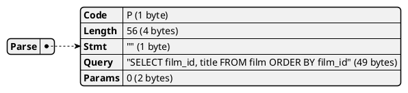

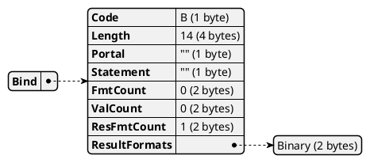

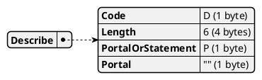

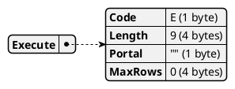

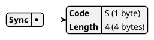

# Packet 2 (242 messages, FrontEnd <-- BackEnd)

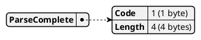

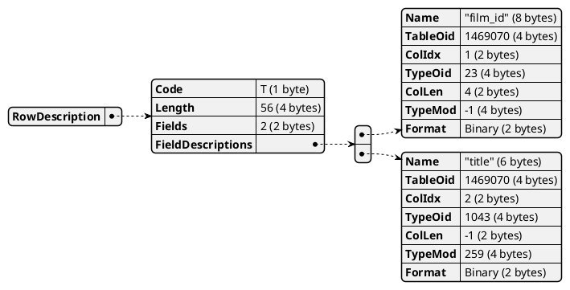

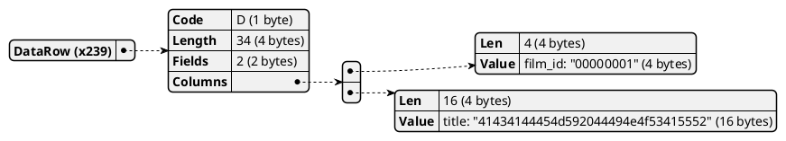

# Packet 3 (248 messages, FrontEnd <-- BackEnd)

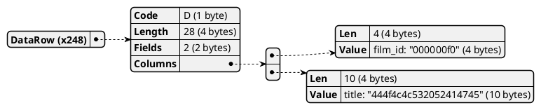

# Packet 4 (249 messages, FrontEnd <-- BackEnd)

# Packet 5 (247 messages, FrontEnd <-- BackEnd)

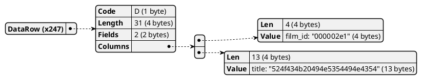

# Packet 6 (19 messages, FrontEnd <-- BackEnd)

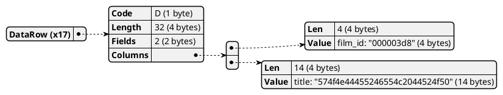

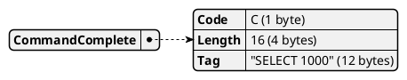

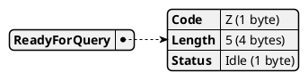

