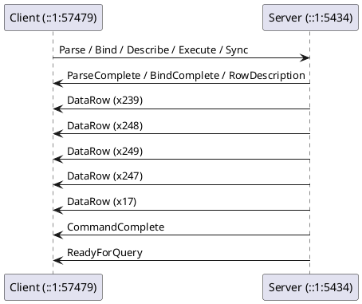

```plantuml
@startuml
participant "Client (::1:57479)" as C
participant "Server (::1:5434)" as S
C -> S : Parse / Bind / Describe / Execute / Sync
S -> C : ParseComplete / BindComplete / RowDescription
S -> C : DataRow (x239)
S -> C : DataRow (x248)
S -> C : DataRow (x249)
S -> C : DataRow (x247)
S -> C : DataRow (x17)
S -> C : CommandComplete
S -> C : ReadyForQuery
@enduml
```
