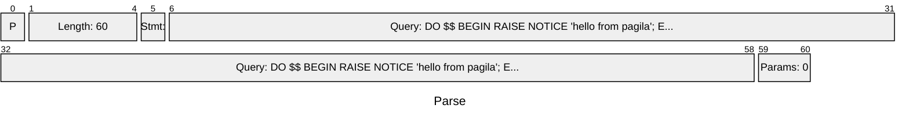
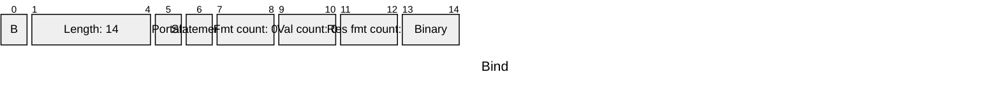
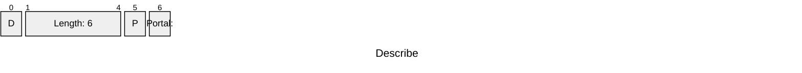
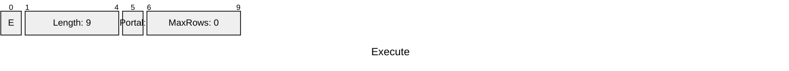
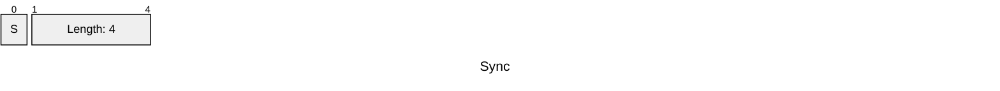
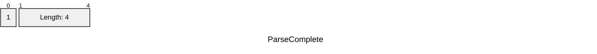
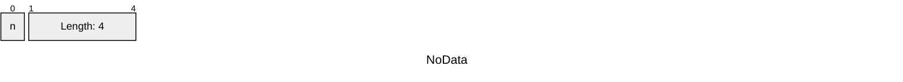
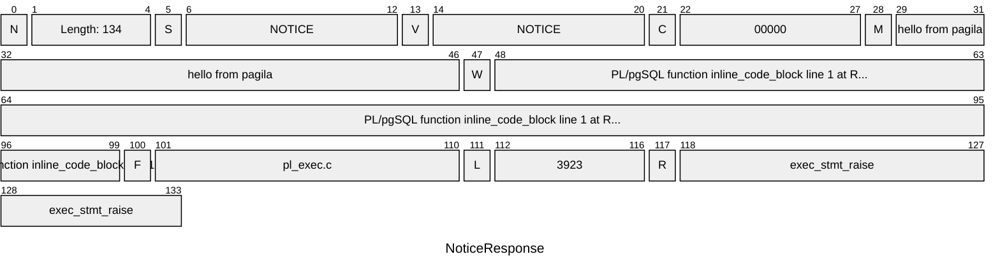
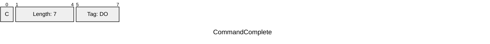
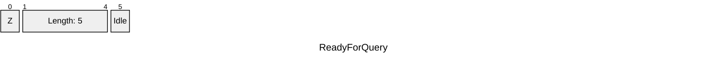

# Packet 1 (5 messages, FrontEnd --> BackEnd)

```mermaid
---
title: "Parse"
config:
  packet:
    bitsPerRow: 32
---
packet
    +1: "P"
    +4: "Length: 60"
    +1: "Stmt: "
    +53: "Query: DO $$ BEGIN RAISE NOTICE 'hello from pagila'; E..."
    +2: "Params: 0"
```

```mermaid
---
title: "Bind"
config:
  packet:
    bitsPerRow: 32
---
packet
    +1: "B"
    +4: "Length: 14"
    +1: "Portal: "
    +1: "Statement: "
    +2: "Fmt count: 0"
    +2: "Val count: 0"
    +2: "Res fmt count: 1"
    +2: "Binary"
```

```mermaid
---
title: "Describe"
config:
  packet:
    bitsPerRow: 32
---
packet
    +1: "D"
    +4: "Length: 6"
    +1: "P"
    +1: "Portal: "
```

```mermaid
---
title: "Execute"
config:
  packet:
    bitsPerRow: 32
---
packet
    +1: "E"
    +4: "Length: 9"
    +1: "Portal: "
    +4: "MaxRows: 0"
```

```mermaid
---
title: "Sync"
config:
  packet:
    bitsPerRow: 32
---
packet
    +1: "S"
    +4: "Length: 4"
```

# Packet 2 (4 messages, FrontEnd <-- BackEnd)

```mermaid
---
title: "ParseComplete"
config:
  packet:
    bitsPerRow: 32
---
packet
    +1: "1"
    +4: "Length: 4"
```

```mermaid
---
title: "BindComplete"
config:
  packet:
    bitsPerRow: 32
---
packet
    +1: "2"
    +4: "Length: 4"
```

```mermaid
---
title: "NoData"
config:
  packet:
    bitsPerRow: 32
---
packet
    +1: "n"
    +4: "Length: 4"
```

```mermaid
---
title: "NoticeResponse"
config:
  packet:
    bitsPerRow: 32
---
packet
    +1: "N"
    +4: "Length: 134"
    +1: "S"
    +7: "NOTICE"
    +1: "V"
    +7: "NOTICE"
    +1: "C"
    +6: "00000"
    +1: "M"
    +18: "hello from pagila"
    +1: "W"
    +52: "PL/pgSQL function inline_code_block line 1 at R..."
    +1: "F"
    +10: "pl_exec.c"
    +1: "L"
    +5: "3923"
    +1: "R"
    +16: "exec_stmt_raise"
```

# Packet 3 (2 messages, FrontEnd <-- BackEnd)

```mermaid
---
title: "CommandComplete"
config:
  packet:
    bitsPerRow: 32
---
packet
    +1: "C"
    +4: "Length: 7"
    +3: "Tag: DO"
```

```mermaid
---
title: "ReadyForQuery"
config:
  packet:
    bitsPerRow: 32
---
packet
    +1: "Z"
    +4: "Length: 5"
    +1: "Idle"
```

