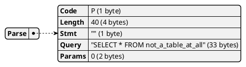
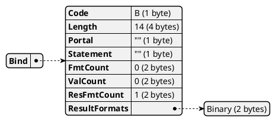
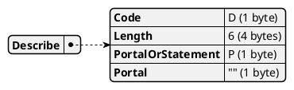
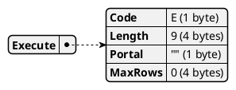
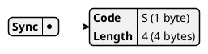
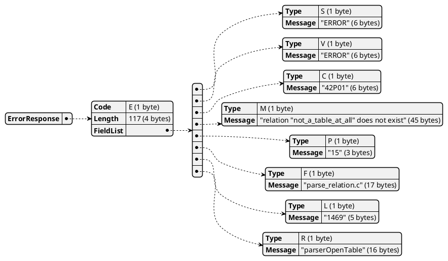
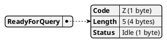

# Packet 1 (5 messages, FrontEnd --> BackEnd)

```plantuml
@startjson
{
  "Parse": {
    "Code": "P (1 byte)",
    "Length": "40 (4 bytes)",
    "Stmt": "\"\" (1 byte)",
    "Query": "\"SELECT * FROM not_a_table_at_all\" (33 bytes)",
    "Params": "0 (2 bytes)"
  }
}
@endjson
```

```plantuml
@startjson
{
  "Bind": {
    "Code": "B (1 byte)",
    "Length": "14 (4 bytes)",
    "Portal": "\"\" (1 byte)",
    "Statement": "\"\" (1 byte)",
    "FmtCount": "0 (2 bytes)",
    "ValCount": "0 (2 bytes)",
    "ResFmtCount": "1 (2 bytes)",
    "ResultFormats": [
      "Binary (2 bytes)"
    ]
  }
}
@endjson
```

```plantuml
@startjson
{
  "Describe": {
    "Code": "D (1 byte)",
    "Length": "6 (4 bytes)",
    "PortalOrStatement": "P (1 byte)",
    "Portal": "\"\" (1 byte)"
  }
}
@endjson
```

```plantuml
@startjson
{
  "Execute": {
    "Code": "E (1 byte)",
    "Length": "9 (4 bytes)",
    "Portal": "\"\" (1 byte)",
    "MaxRows": "0 (4 bytes)"
  }
}
@endjson
```

```plantuml
@startjson
{
  "Sync": {
    "Code": "S (1 byte)",
    "Length": "4 (4 bytes)"
  }
}
@endjson
```

# Packet 2 (1 messages, FrontEnd <-- BackEnd)

```plantuml
@startjson
{
  "ErrorResponse": {
    "Code": "E (1 byte)",
    "Length": "117 (4 bytes)",
    "FieldList": [
      {
        "Type": "S (1 byte)",
        "Message": "\"ERROR\" (6 bytes)"
      },
      {
        "Type": "V (1 byte)",
        "Message": "\"ERROR\" (6 bytes)"
      },
      {
        "Type": "C (1 byte)",
        "Message": "\"42P01\" (6 bytes)"
      },
      {
        "Type": "M (1 byte)",
        "Message": "\"relation \"not_a_table_at_all\" does not exist\" (45 bytes)"
      },
      {
        "Type": "P (1 byte)",
        "Message": "\"15\" (3 bytes)"
      },
      {
        "Type": "F (1 byte)",
        "Message": "\"parse_relation.c\" (17 bytes)"
      },
      {
        "Type": "L (1 byte)",
        "Message": "\"1469\" (5 bytes)"
      },
      {
        "Type": "R (1 byte)",
        "Message": "\"parserOpenTable\" (16 bytes)"
      }
    ]
  }
}
@endjson
```

# Packet 3 (1 messages, FrontEnd <-- BackEnd)

```plantuml
@startjson
{
  "ReadyForQuery": {
    "Code": "Z (1 byte)",
    "Length": "5 (4 bytes)",
    "Status": "Idle (1 byte)"
  }
}
@endjson
```

