# Packet 1 (5 messages, FrontEnd --> BackEnd)

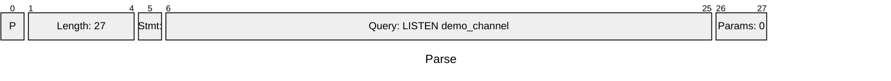

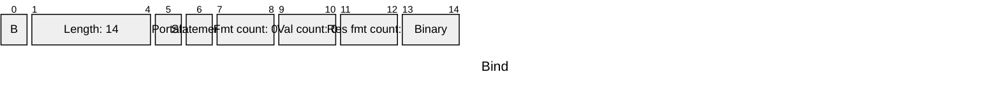

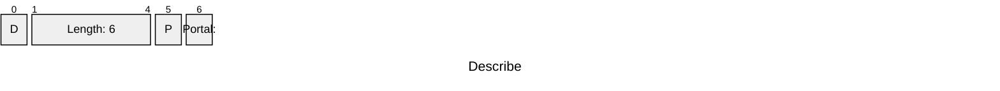

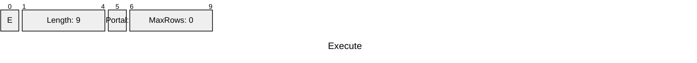

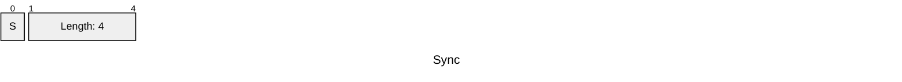


# Packet 2 (5 messages, FrontEnd <-- BackEnd)

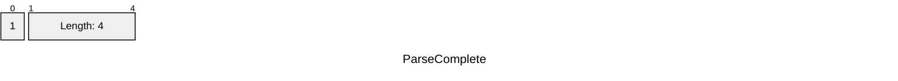


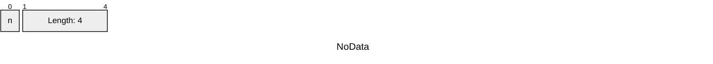

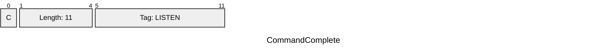

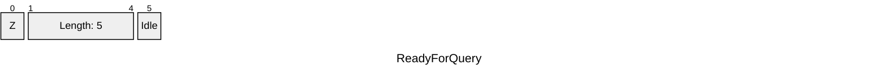


# Packet 3 (1 messages, FrontEnd --> BackEnd)

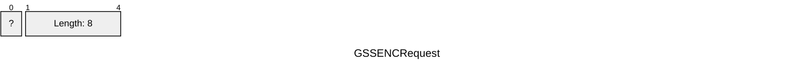


# Packet 4 (1 messages, FrontEnd <-- BackEnd)

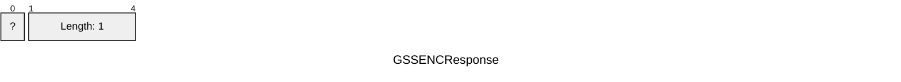


# Packet 5 (1 messages, FrontEnd --> BackEnd)

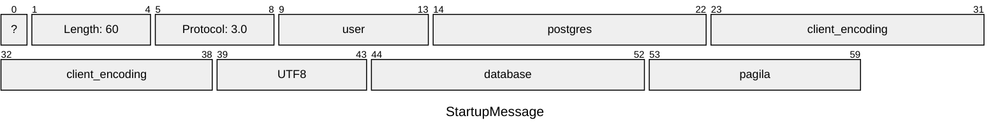


# Packet 6 (1 messages, FrontEnd <-- BackEnd)

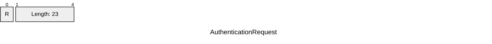


# Packet 7 (1 messages, FrontEnd --> BackEnd)

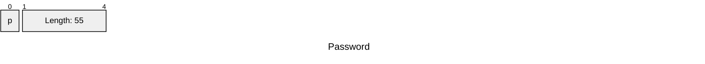


# Packet 8 (1 messages, FrontEnd <-- BackEnd)

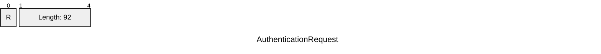


# Packet 9 (1 messages, FrontEnd --> BackEnd)

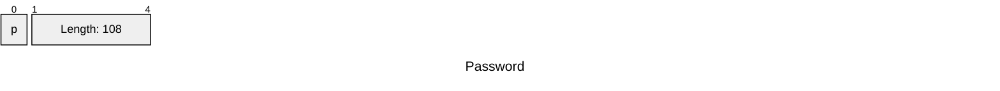


# Packet 10 (19 messages, FrontEnd <-- BackEnd)

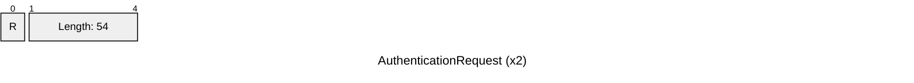

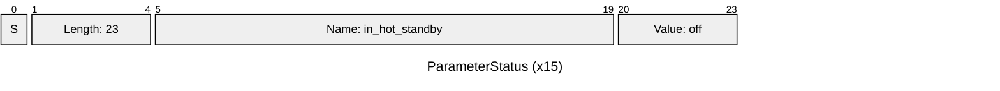

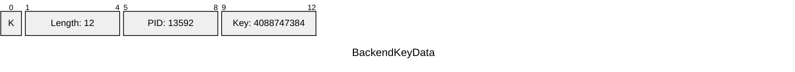

```mermaid
---
title: "NoticeResponse"
config:
  packet:
    bitsPerRow: 32
---
packet
    +1: "N"
    +4: "Length: 178"
    +1: "S"
    +7: "NOTICE"
    +1: "V"
    +7: "NOTICE"
    +1: "C"
    +6: "00000"
    +1: "M"
    +61: "Welcome to Pagila, the time is 2026-05-21 09:41..."
    +1: "W"
    +53: "PL/pgSQL function _welcome_message() line 3 at ..."
    +1: "F"
    +10: "pl_exec.c"
    +1: "L"
    +5: "3923"
    +1: "R"
    +16: "exec_stmt_raise"
```


# Packet 11 (1 messages, FrontEnd <-- BackEnd)

```mermaid
---
title: "ReadyForQuery"
config:
  packet:
    bitsPerRow: 32
---
packet
    +1: "Z"
    +4: "Length: 5"
    +1: "Idle"
```


# Packet 12 (5 messages, FrontEnd --> BackEnd)

```mermaid
---
title: "Parse"
config:
  packet:
    bitsPerRow: 32
---
packet
    +1: "P"
    +4: "Length: 52"
    +1: "Stmt: "
    +45: "Query: NOTIFY demo_channel, 'hello-from-other-conn'"
    +2: "Params: 0"
```

```mermaid
---
title: "Bind"
config:
  packet:
    bitsPerRow: 32
---
packet
    +1: "B"
    +4: "Length: 14"
    +1: "Portal: "
    +1: "Statement: "
    +2: "Fmt count: 0"
    +2: "Val count: 0"
    +2: "Res fmt count: 1"
    +2: "Binary"
```

```mermaid
---
title: "Describe"
config:
  packet:
    bitsPerRow: 32
---
packet
    +1: "D"
    +4: "Length: 6"
    +1: "P"
    +1: "Portal: "
```

```mermaid
---
title: "Execute"
config:
  packet:
    bitsPerRow: 32
---
packet
    +1: "E"
    +4: "Length: 9"
    +1: "Portal: "
    +4: "MaxRows: 0"
```

```mermaid
---
title: "Sync"
config:
  packet:
    bitsPerRow: 32
---
packet
    +1: "S"
    +4: "Length: 4"
```


# Packet 13 (5 messages, FrontEnd <-- BackEnd)

```mermaid
---
title: "ParseComplete"
config:
  packet:
    bitsPerRow: 32
---
packet
    +1: "1"
    +4: "Length: 4"
```

```mermaid
---
title: "BindComplete"
config:
  packet:
    bitsPerRow: 32
---
packet
    +1: "2"
    +4: "Length: 4"
```

```mermaid
---
title: "NoData"
config:
  packet:
    bitsPerRow: 32
---
packet
    +1: "n"
    +4: "Length: 4"
```

```mermaid
---
title: "CommandComplete"
config:
  packet:
    bitsPerRow: 32
---
packet
    +1: "C"
    +4: "Length: 11"
    +7: "Tag: NOTIFY"
```

```mermaid
---
title: "ReadyForQuery"
config:
  packet:
    bitsPerRow: 32
---
packet
    +1: "Z"
    +4: "Length: 5"
    +1: "Idle"
```


# Packet 14 (1 messages, FrontEnd <-- BackEnd)

```mermaid
---
title: "Unknown"
config:
  packet:
    bitsPerRow: 32
---
packet
    +1: "A"
    +4: "Length: 43"
```


# Packet 15 (1 messages, FrontEnd --> BackEnd)

```mermaid
---
title: "Terminate"
config:
  packet:
    bitsPerRow: 32
---
packet
    +1: "X"
    +4: "Length: 4"
```


# Packet 16 (5 messages, FrontEnd --> BackEnd)

```mermaid
---
title: "Parse"
config:
  packet:
    bitsPerRow: 32
---
packet
    +1: "P"
    +4: "Length: 16"
    +1: "Stmt: "
    +9: "Query: SELECT 1"
    +2: "Params: 0"
```

```mermaid
---
title: "Bind"
config:
  packet:
    bitsPerRow: 32
---
packet
    +1: "B"
    +4: "Length: 14"
    +1: "Portal: "
    +1: "Statement: "
    +2: "Fmt count: 0"
    +2: "Val count: 0"
    +2: "Res fmt count: 1"
    +2: "Binary"
```

```mermaid
---
title: "Describe"
config:
  packet:
    bitsPerRow: 32
---
packet
    +1: "D"
    +4: "Length: 6"
    +1: "P"
    +1: "Portal: "
```

```mermaid
---
title: "Execute"
config:
  packet:
    bitsPerRow: 32
---
packet
    +1: "E"
    +4: "Length: 9"
    +1: "Portal: "
    +4: "MaxRows: 0"
```

```mermaid
---
title: "Sync"
config:
  packet:
    bitsPerRow: 32
---
packet
    +1: "S"
    +4: "Length: 4"
```


# Packet 17 (6 messages, FrontEnd <-- BackEnd)

```mermaid
---
title: "ParseComplete"
config:
  packet:
    bitsPerRow: 32
---
packet
    +1: "1"
    +4: "Length: 4"
```

```mermaid
---
title: "BindComplete"
config:
  packet:
    bitsPerRow: 32
---
packet
    +1: "2"
    +4: "Length: 4"
```

```mermaid
---
title: "RowDescription"
config:
  packet:
    bitsPerRow: 32
---
packet
    +1: "T"
    +4: "Length: 33"
    +2: "Fields: 1"
    +9: "Name: ?column?"
    +4: "TableOid: 0"
    +2: "ColIdx: 0"
    +4: "TypeOid: 23"
    +2: "ColLen: 4"
    +4: "TypeMod: -1"
    +2: "Binary"
```

```mermaid
---
title: "DataRow"
config:
  packet:
    bitsPerRow: 32
---
packet
    +1: "D"
    +4: "Length: 14"
    +2: "Fields: 1"
    +4: "Len: 4"
    +4: "?column?: 00000001"
```

```mermaid
---
title: "CommandComplete"
config:
  packet:
    bitsPerRow: 32
---
packet
    +1: "C"
    +4: "Length: 13"
    +9: "Tag: SELECT 1"
```

```mermaid
---
title: "ReadyForQuery"
config:
  packet:
    bitsPerRow: 32
---
packet
    +1: "Z"
    +4: "Length: 5"
    +1: "Idle"
```


# Packet 18 (5 messages, FrontEnd --> BackEnd)

```mermaid
---
title: "Parse"
config:
  packet:
    bitsPerRow: 32
---
packet
    +1: "P"
    +4: "Length: 29"
    +1: "Stmt: "
    +22: "Query: UNLISTEN demo_channel"
    +2: "Params: 0"
```

```mermaid
---
title: "Bind"
config:
  packet:
    bitsPerRow: 32
---
packet
    +1: "B"
    +4: "Length: 14"
    +1: "Portal: "
    +1: "Statement: "
    +2: "Fmt count: 0"
    +2: "Val count: 0"
    +2: "Res fmt count: 1"
    +2: "Binary"
```

```mermaid
---
title: "Describe"
config:
  packet:
    bitsPerRow: 32
---
packet
    +1: "D"
    +4: "Length: 6"
    +1: "P"
    +1: "Portal: "
```

```mermaid
---
title: "Execute"
config:
  packet:
    bitsPerRow: 32
---
packet
    +1: "E"
    +4: "Length: 9"
    +1: "Portal: "
    +4: "MaxRows: 0"
```

```mermaid
---
title: "Sync"
config:
  packet:
    bitsPerRow: 32
---
packet
    +1: "S"
    +4: "Length: 4"
```


# Packet 19 (5 messages, FrontEnd <-- BackEnd)

```mermaid
---
title: "ParseComplete"
config:
  packet:
    bitsPerRow: 32
---
packet
    +1: "1"
    +4: "Length: 4"
```

```mermaid
---
title: "BindComplete"
config:
  packet:
    bitsPerRow: 32
---
packet
    +1: "2"
    +4: "Length: 4"
```

```mermaid
---
title: "NoData"
config:
  packet:
    bitsPerRow: 32
---
packet
    +1: "n"
    +4: "Length: 4"
```

```mermaid
---
title: "CommandComplete"
config:
  packet:
    bitsPerRow: 32
---
packet
    +1: "C"
    +4: "Length: 13"
    +9: "Tag: UNLISTEN"
```

```mermaid
---
title: "ReadyForQuery"
config:
  packet:
    bitsPerRow: 32
---
packet
    +1: "Z"
    +4: "Length: 5"
    +1: "Idle"
```

