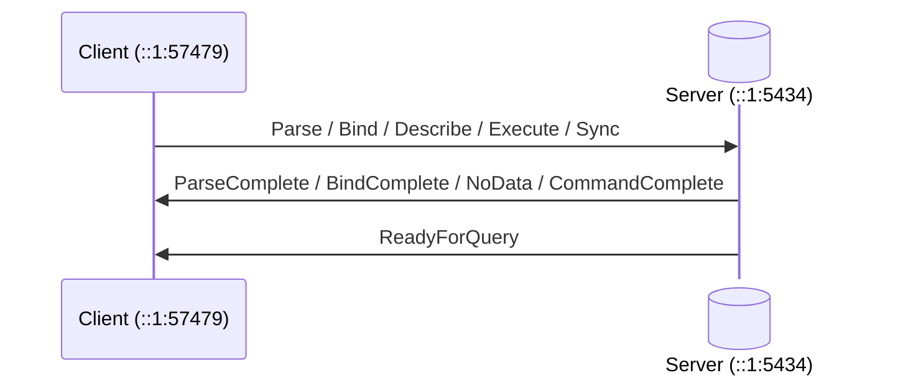
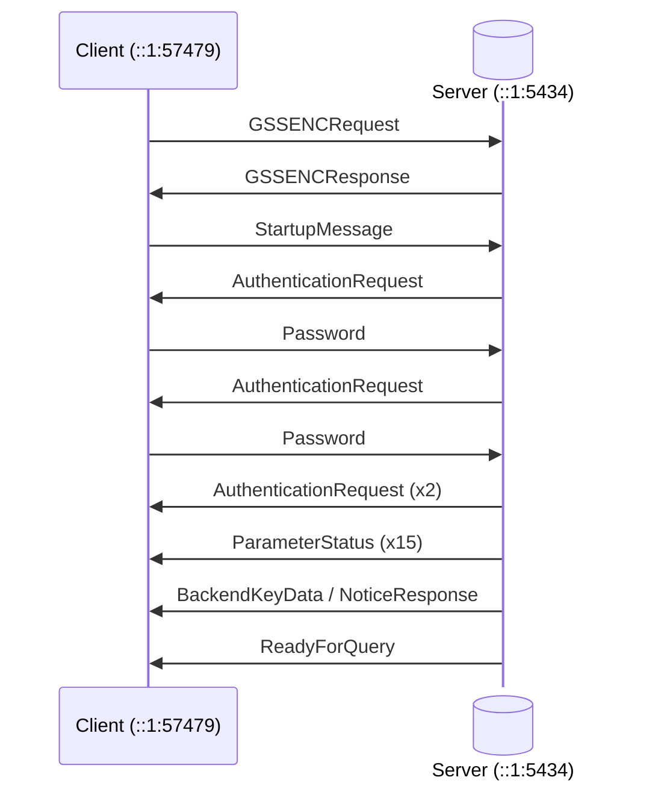
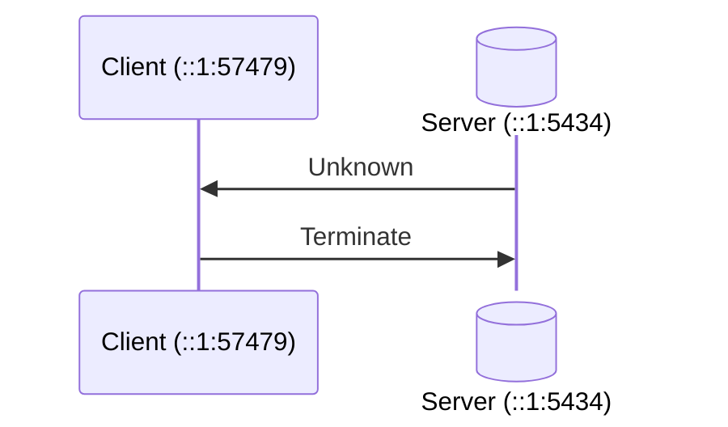
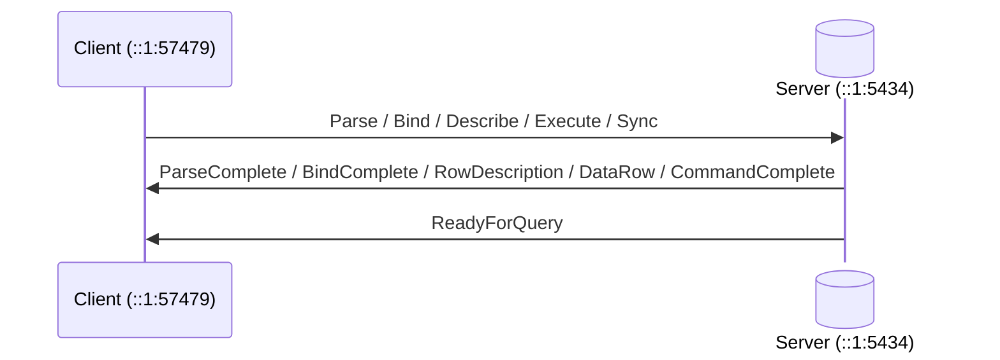

```mermaid
sequenceDiagram
    participant C as Client (::1:57479)
    participant S@{ "type" : "database" } as Server (::1:5434)
    C->>S: Parse / Bind / Describe / Execute / Sync
    S->>C: ParseComplete / BindComplete / NoData / CommandComplete
    S->>C: ReadyForQuery
```

```mermaid
sequenceDiagram
    participant C as Client (::1:57479)
    participant S@{ "type" : "database" } as Server (::1:5434)
    C->>S: GSSENCRequest
    S->>C: GSSENCResponse
    C->>S: StartupMessage
    S->>C: AuthenticationRequest
    C->>S: Password
    S->>C: AuthenticationRequest
    C->>S: Password
    S->>C: AuthenticationRequest (x2)
    S->>C: ParameterStatus (x15)
    S->>C: BackendKeyData / NoticeResponse
    S->>C: ReadyForQuery
```

```mermaid
sequenceDiagram
    participant C as Client (::1:57479)
    participant S@{ "type" : "database" } as Server (::1:5434)
    C->>S: Parse / Bind / Describe / Execute / Sync
    S->>C: ParseComplete / BindComplete / NoData / CommandComplete
    S->>C: ReadyForQuery
```

```mermaid
sequenceDiagram
    participant C as Client (::1:57479)
    participant S@{ "type" : "database" } as Server (::1:5434)
    S->>C: Unknown
    C->>S: Terminate
```

```mermaid
sequenceDiagram
    participant C as Client (::1:57479)
    participant S@{ "type" : "database" } as Server (::1:5434)
    C->>S: Parse / Bind / Describe / Execute / Sync
    S->>C: ParseComplete / BindComplete / RowDescription / DataRow / CommandComplete
    S->>C: ReadyForQuery
```

```mermaid
sequenceDiagram
    participant C as Client (::1:57479)
    participant S@{ "type" : "database" } as Server (::1:5434)
    C->>S: Parse / Bind / Describe / Execute / Sync
    S->>C: ParseComplete / BindComplete / NoData / CommandComplete
    S->>C: ReadyForQuery
```
