# Packet 1 (5 messages, FrontEnd --> BackEnd)

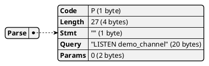

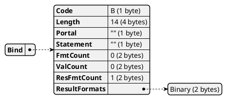

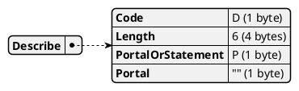

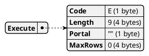

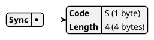


# Packet 2 (5 messages, FrontEnd <-- BackEnd)

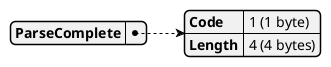


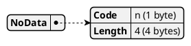

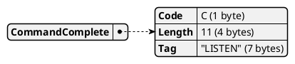

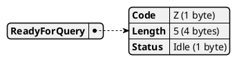


# Packet 3 (1 messages, FrontEnd --> BackEnd)

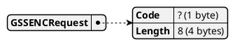


# Packet 4 (1 messages, FrontEnd <-- BackEnd)

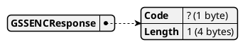


# Packet 5 (1 messages, FrontEnd --> BackEnd)

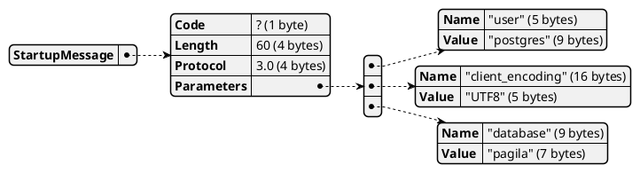


# Packet 6 (1 messages, FrontEnd <-- BackEnd)


# Packet 7 (1 messages, FrontEnd --> BackEnd)

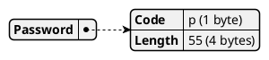


# Packet 8 (1 messages, FrontEnd <-- BackEnd)

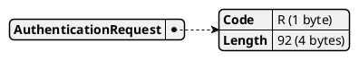


# Packet 9 (1 messages, FrontEnd --> BackEnd)

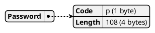


# Packet 10 (19 messages, FrontEnd <-- BackEnd)

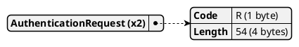

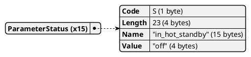

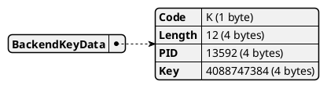

```plantuml
@startjson
{
  "NoticeResponse": {
    "Code": "N (1 byte)",
    "Length": "178 (4 bytes)",
    "FieldList": [
      {
        "Type": "S (1 byte)",
        "Message": "\"NOTICE\" (7 bytes)"
      },
      {
        "Type": "V (1 byte)",
        "Message": "\"NOTICE\" (7 bytes)"
      },
      {
        "Type": "C (1 byte)",
        "Message": "\"00000\" (6 bytes)"
      },
      {
        "Type": "M (1 byte)",
        "Message": "\"Welcome to Pagila, the time is 2026-05-21 09:41...\" (61 bytes)"
      },
      {
        "Type": "W (1 byte)",
        "Message": "\"PL/pgSQL function _welcome_message() line 3 at ...\" (53 bytes)"
      },
      {
        "Type": "F (1 byte)",
        "Message": "\"pl_exec.c\" (10 bytes)"
      },
      {
        "Type": "L (1 byte)",
        "Message": "\"3923\" (5 bytes)"
      },
      {
        "Type": "R (1 byte)",
        "Message": "\"exec_stmt_raise\" (16 bytes)"
      }
    ]
  }
}
@endjson
```


# Packet 11 (1 messages, FrontEnd <-- BackEnd)

```plantuml
@startjson
{
  "ReadyForQuery": {
    "Code": "Z (1 byte)",
    "Length": "5 (4 bytes)",
    "Status": "Idle (1 byte)"
  }
}
@endjson
```


# Packet 12 (5 messages, FrontEnd --> BackEnd)

```plantuml
@startjson
{
  "Parse": {
    "Code": "P (1 byte)",
    "Length": "52 (4 bytes)",
    "Stmt": "\"\" (1 byte)",
    "Query": "\"NOTIFY demo_channel, 'hello-from-other-conn'\" (45 bytes)",
    "Params": "0 (2 bytes)"
  }
}
@endjson
```

```plantuml
@startjson
{
  "Bind": {
    "Code": "B (1 byte)",
    "Length": "14 (4 bytes)",
    "Portal": "\"\" (1 byte)",
    "Statement": "\"\" (1 byte)",
    "FmtCount": "0 (2 bytes)",
    "ValCount": "0 (2 bytes)",
    "ResFmtCount": "1 (2 bytes)",
    "ResultFormats": [
      "Binary (2 bytes)"
    ]
  }
}
@endjson
```

```plantuml
@startjson
{
  "Describe": {
    "Code": "D (1 byte)",
    "Length": "6 (4 bytes)",
    "PortalOrStatement": "P (1 byte)",
    "Portal": "\"\" (1 byte)"
  }
}
@endjson
```

```plantuml
@startjson
{
  "Execute": {
    "Code": "E (1 byte)",
    "Length": "9 (4 bytes)",
    "Portal": "\"\" (1 byte)",
    "MaxRows": "0 (4 bytes)"
  }
}
@endjson
```

```plantuml
@startjson
{
  "Sync": {
    "Code": "S (1 byte)",
    "Length": "4 (4 bytes)"
  }
}
@endjson
```


# Packet 13 (5 messages, FrontEnd <-- BackEnd)

```plantuml
@startjson
{
  "ParseComplete": {
    "Code": "1 (1 byte)",
    "Length": "4 (4 bytes)"
  }
}
@endjson
```

```plantuml
@startjson
{
  "BindComplete": {
    "Code": "2 (1 byte)",
    "Length": "4 (4 bytes)"
  }
}
@endjson
```

```plantuml
@startjson
{
  "NoData": {
    "Code": "n (1 byte)",
    "Length": "4 (4 bytes)"
  }
}
@endjson
```

```plantuml
@startjson
{
  "CommandComplete": {
    "Code": "C (1 byte)",
    "Length": "11 (4 bytes)",
    "Tag": "\"NOTIFY\" (7 bytes)"
  }
}
@endjson
```

```plantuml
@startjson
{
  "ReadyForQuery": {
    "Code": "Z (1 byte)",
    "Length": "5 (4 bytes)",
    "Status": "Idle (1 byte)"
  }
}
@endjson
```


# Packet 14 (1 messages, FrontEnd <-- BackEnd)

```plantuml
@startjson
{
  "Unknown": {
    "Code": "A (1 byte)",
    "Length": "43 (4 bytes)"
  }
}
@endjson
```


# Packet 15 (1 messages, FrontEnd --> BackEnd)

```plantuml
@startjson
{
  "Terminate": {
    "Code": "X (1 byte)",
    "Length": "4 (4 bytes)"
  }
}
@endjson
```


# Packet 16 (5 messages, FrontEnd --> BackEnd)

```plantuml
@startjson
{
  "Parse": {
    "Code": "P (1 byte)",
    "Length": "16 (4 bytes)",
    "Stmt": "\"\" (1 byte)",
    "Query": "\"SELECT 1\" (9 bytes)",
    "Params": "0 (2 bytes)"
  }
}
@endjson
```

```plantuml
@startjson
{
  "Bind": {
    "Code": "B (1 byte)",
    "Length": "14 (4 bytes)",
    "Portal": "\"\" (1 byte)",
    "Statement": "\"\" (1 byte)",
    "FmtCount": "0 (2 bytes)",
    "ValCount": "0 (2 bytes)",
    "ResFmtCount": "1 (2 bytes)",
    "ResultFormats": [
      "Binary (2 bytes)"
    ]
  }
}
@endjson
```

```plantuml
@startjson
{
  "Describe": {
    "Code": "D (1 byte)",
    "Length": "6 (4 bytes)",
    "PortalOrStatement": "P (1 byte)",
    "Portal": "\"\" (1 byte)"
  }
}
@endjson
```

```plantuml
@startjson
{
  "Execute": {
    "Code": "E (1 byte)",
    "Length": "9 (4 bytes)",
    "Portal": "\"\" (1 byte)",
    "MaxRows": "0 (4 bytes)"
  }
}
@endjson
```

```plantuml
@startjson
{
  "Sync": {
    "Code": "S (1 byte)",
    "Length": "4 (4 bytes)"
  }
}
@endjson
```


# Packet 17 (6 messages, FrontEnd <-- BackEnd)

```plantuml
@startjson
{
  "ParseComplete": {
    "Code": "1 (1 byte)",
    "Length": "4 (4 bytes)"
  }
}
@endjson
```

```plantuml
@startjson
{
  "BindComplete": {
    "Code": "2 (1 byte)",
    "Length": "4 (4 bytes)"
  }
}
@endjson
```

```plantuml
@startjson
{
  "RowDescription": {
    "Code": "T (1 byte)",
    "Length": "33 (4 bytes)",
    "Fields": "1 (2 bytes)",
    "FieldDescriptions": [
      {
        "Name": "\"?column?\" (9 bytes)",
        "TableOid": "0 (4 bytes)",
        "ColIdx": "0 (2 bytes)",
        "TypeOid": "23 (4 bytes)",
        "ColLen": "4 (2 bytes)",
        "TypeMod": "-1 (4 bytes)",
        "Format": "Binary (2 bytes)"
      }
    ]
  }
}
@endjson
```

```plantuml
@startjson
{
  "DataRow": {
    "Code": "D (1 byte)",
    "Length": "14 (4 bytes)",
    "Fields": "1 (2 bytes)",
    "Columns": [
      {
        "Len": "4 (4 bytes)",
        "Value": "?column?: \"00000001\" (4 bytes)"
      }
    ]
  }
}
@endjson
```

```plantuml
@startjson
{
  "CommandComplete": {
    "Code": "C (1 byte)",
    "Length": "13 (4 bytes)",
    "Tag": "\"SELECT 1\" (9 bytes)"
  }
}
@endjson
```

```plantuml
@startjson
{
  "ReadyForQuery": {
    "Code": "Z (1 byte)",
    "Length": "5 (4 bytes)",
    "Status": "Idle (1 byte)"
  }
}
@endjson
```


# Packet 18 (5 messages, FrontEnd --> BackEnd)

```plantuml
@startjson
{
  "Parse": {
    "Code": "P (1 byte)",
    "Length": "29 (4 bytes)",
    "Stmt": "\"\" (1 byte)",
    "Query": "\"UNLISTEN demo_channel\" (22 bytes)",
    "Params": "0 (2 bytes)"
  }
}
@endjson
```

```plantuml
@startjson
{
  "Bind": {
    "Code": "B (1 byte)",
    "Length": "14 (4 bytes)",
    "Portal": "\"\" (1 byte)",
    "Statement": "\"\" (1 byte)",
    "FmtCount": "0 (2 bytes)",
    "ValCount": "0 (2 bytes)",
    "ResFmtCount": "1 (2 bytes)",
    "ResultFormats": [
      "Binary (2 bytes)"
    ]
  }
}
@endjson
```

```plantuml
@startjson
{
  "Describe": {
    "Code": "D (1 byte)",
    "Length": "6 (4 bytes)",
    "PortalOrStatement": "P (1 byte)",
    "Portal": "\"\" (1 byte)"
  }
}
@endjson
```

```plantuml
@startjson
{
  "Execute": {
    "Code": "E (1 byte)",
    "Length": "9 (4 bytes)",
    "Portal": "\"\" (1 byte)",
    "MaxRows": "0 (4 bytes)"
  }
}
@endjson
```

```plantuml
@startjson
{
  "Sync": {
    "Code": "S (1 byte)",
    "Length": "4 (4 bytes)"
  }
}
@endjson
```


# Packet 19 (5 messages, FrontEnd <-- BackEnd)

```plantuml
@startjson
{
  "ParseComplete": {
    "Code": "1 (1 byte)",
    "Length": "4 (4 bytes)"
  }
}
@endjson
```

```plantuml
@startjson
{
  "BindComplete": {
    "Code": "2 (1 byte)",
    "Length": "4 (4 bytes)"
  }
}
@endjson
```

```plantuml
@startjson
{
  "NoData": {
    "Code": "n (1 byte)",
    "Length": "4 (4 bytes)"
  }
}
@endjson
```

```plantuml
@startjson
{
  "CommandComplete": {
    "Code": "C (1 byte)",
    "Length": "13 (4 bytes)",
    "Tag": "\"UNLISTEN\" (9 bytes)"
  }
}
@endjson
```

```plantuml
@startjson
{
  "ReadyForQuery": {
    "Code": "Z (1 byte)",
    "Length": "5 (4 bytes)",
    "Status": "Idle (1 byte)"
  }
}
@endjson
```

