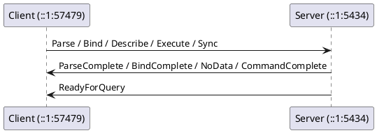
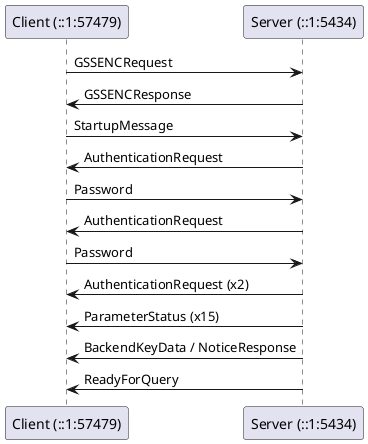
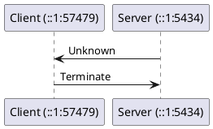
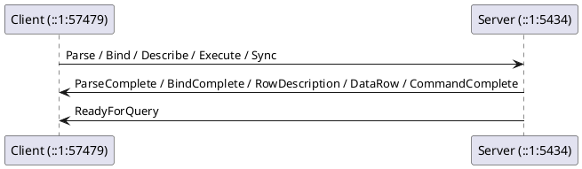

```plantuml
@startuml
participant "Client (::1:57479)" as C
participant "Server (::1:5434)" as S
C -> S : Parse / Bind / Describe / Execute / Sync
S -> C : ParseComplete / BindComplete / NoData / CommandComplete
S -> C : ReadyForQuery
@enduml
```

```plantuml
@startuml
participant "Client (::1:57479)" as C
participant "Server (::1:5434)" as S
C -> S : GSSENCRequest
S -> C : GSSENCResponse
C -> S : StartupMessage
S -> C : AuthenticationRequest
C -> S : Password
S -> C : AuthenticationRequest
C -> S : Password
S -> C : AuthenticationRequest (x2)
S -> C : ParameterStatus (x15)
S -> C : BackendKeyData / NoticeResponse
S -> C : ReadyForQuery
@enduml
```

```plantuml
@startuml
participant "Client (::1:57479)" as C
participant "Server (::1:5434)" as S
C -> S : Parse / Bind / Describe / Execute / Sync
S -> C : ParseComplete / BindComplete / NoData / CommandComplete
S -> C : ReadyForQuery
@enduml
```

```plantuml
@startuml
participant "Client (::1:57479)" as C
participant "Server (::1:5434)" as S
S -> C : Unknown
C -> S : Terminate
@enduml
```

```plantuml
@startuml
participant "Client (::1:57479)" as C
participant "Server (::1:5434)" as S
C -> S : Parse / Bind / Describe / Execute / Sync
S -> C : ParseComplete / BindComplete / RowDescription / DataRow / CommandComplete
S -> C : ReadyForQuery
@enduml
```

```plantuml
@startuml
participant "Client (::1:57479)" as C
participant "Server (::1:5434)" as S
C -> S : Parse / Bind / Describe / Execute / Sync
S -> C : ParseComplete / BindComplete / NoData / CommandComplete
S -> C : ReadyForQuery
@enduml
```
