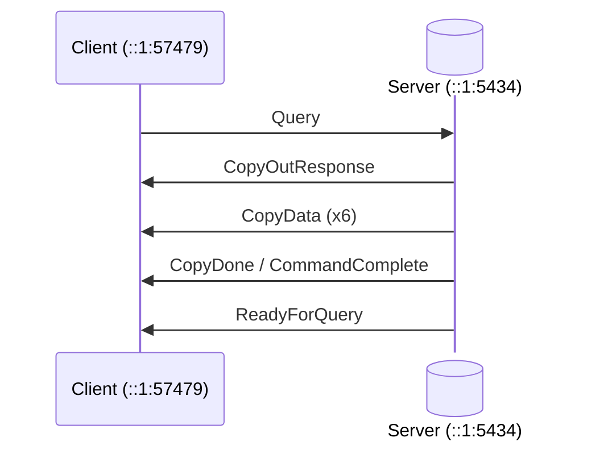

```mermaid
sequenceDiagram
    participant C as Client (::1:57479)
    participant S@{ "type" : "database" } as Server (::1:5434)
    C->>S: Query
    S->>C: CopyOutResponse
    S->>C: CopyData (x6)
    S->>C: CopyDone / CommandComplete
    S->>C: ReadyForQuery
```
