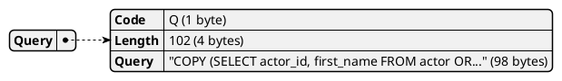
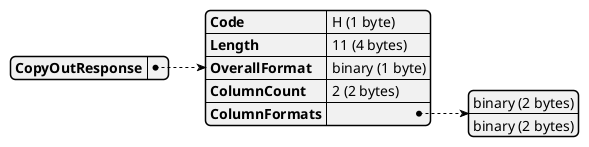
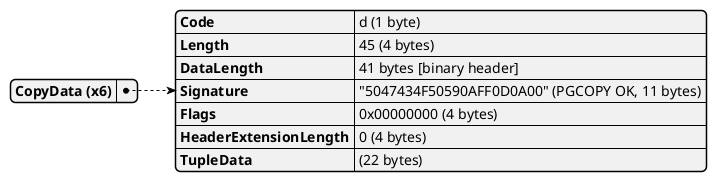
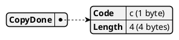
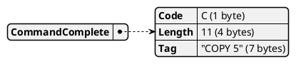
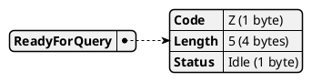

# Packet 1 (1 messages, FrontEnd --> BackEnd)

```plantuml
@startjson
{
  "Query": {
    "Code": "Q (1 byte)",
    "Length": "102 (4 bytes)",
    "Query": "\"COPY (SELECT actor_id, first_name FROM actor OR...\" (98 bytes)"
  }
}
@endjson
```

# Packet 2 (10 messages, FrontEnd <-- BackEnd)

```plantuml
@startjson
{
  "CopyOutResponse": {
    "Code": "H (1 byte)",
    "Length": "11 (4 bytes)",
    "OverallFormat": "binary (1 byte)",
    "ColumnCount": "2 (2 bytes)",
    "ColumnFormats": [
      "binary (2 bytes)",
      "binary (2 bytes)"
    ]
  }
}
@endjson
```

```plantuml
@startjson
{
  "CopyData (x6)": {
    "Code": "d (1 byte)",
    "Length": "45 (4 bytes)",
    "DataLength": "41 bytes [binary header]",
    "Signature": "\"5047434F50590AFF0D0A00\" (PGCOPY OK, 11 bytes)",
    "Flags": "0x00000000 (4 bytes)",
    "HeaderExtensionLength": "0 (4 bytes)",
    "TupleData": "(22 bytes)"
  }
}
@endjson
```

```plantuml
@startjson
{
  "CopyDone": {
    "Code": "c (1 byte)",
    "Length": "4 (4 bytes)"
  }
}
@endjson
```

```plantuml
@startjson
{
  "CommandComplete": {
    "Code": "C (1 byte)",
    "Length": "11 (4 bytes)",
    "Tag": "\"COPY 5\" (7 bytes)"
  }
}
@endjson
```

```plantuml
@startjson
{
  "ReadyForQuery": {
    "Code": "Z (1 byte)",
    "Length": "5 (4 bytes)",
    "Status": "Idle (1 byte)"
  }
}
@endjson
```

