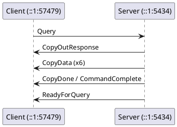

```plantuml
@startuml
participant "Client (::1:57479)" as C
participant "Server (::1:5434)" as S
C -> S : Query
S -> C : CopyOutResponse
S -> C : CopyData (x6)
S -> C : CopyDone / CommandComplete
S -> C : ReadyForQuery
@enduml
```
