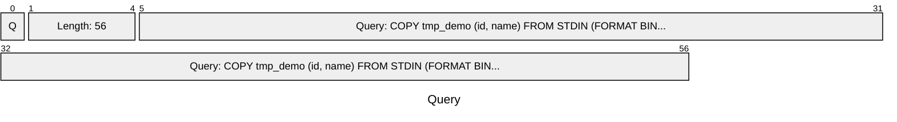
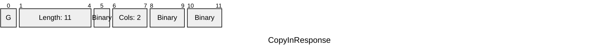
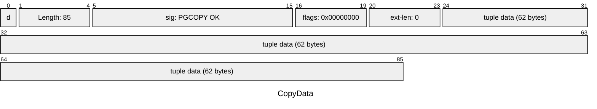
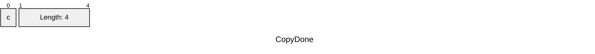
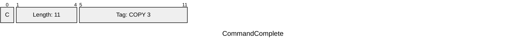
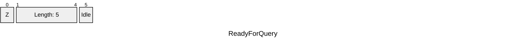

# Packet 1 (1 messages, FrontEnd --> BackEnd)

# Packet 2 (1 messages, FrontEnd <-- BackEnd)

# Packet 3 (1 messages, FrontEnd --> BackEnd)

# Packet 4 (1 messages, FrontEnd --> BackEnd)

# Packet 5 (2 messages, FrontEnd <-- BackEnd)

