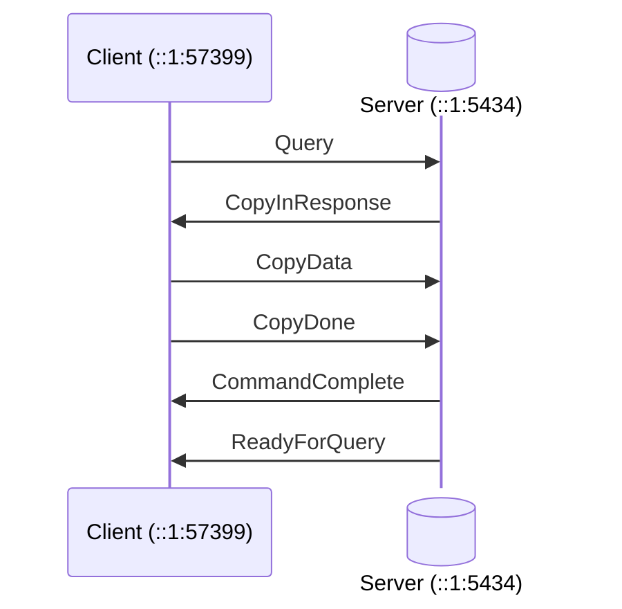

```mermaid
sequenceDiagram
    participant C as Client (::1:57399)
    participant S@{ "type" : "database" } as Server (::1:5434)
    C->>S: Query
    S->>C: CopyInResponse
    C->>S: CopyData
    C->>S: CopyDone
    S->>C: CommandComplete
    S->>C: ReadyForQuery
```
