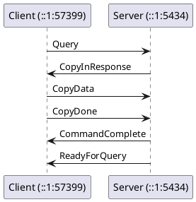

```plantuml
@startuml
participant "Client (::1:57399)" as C
participant "Server (::1:5434)" as S
C -> S : Query
S -> C : CopyInResponse
C -> S : CopyData
C -> S : CopyDone
S -> C : CommandComplete
S -> C : ReadyForQuery
@enduml
```
