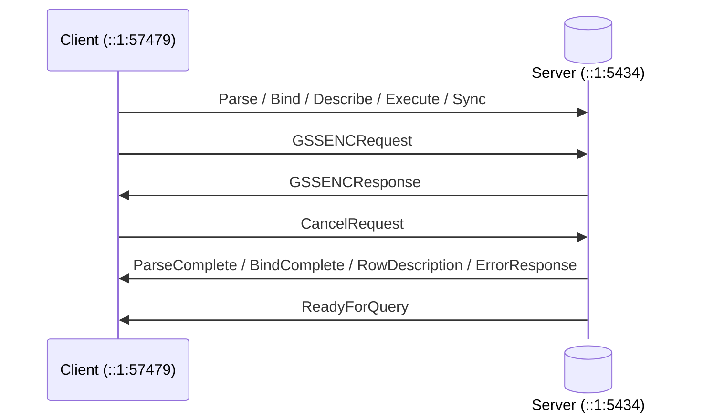

```mermaid
sequenceDiagram
    participant C as Client (::1:57479)
    participant S@{ "type" : "database" } as Server (::1:5434)
    C->>S: Parse / Bind / Describe / Execute / Sync
    C->>S: GSSENCRequest
    S->>C: GSSENCResponse
    C->>S: CancelRequest
    S->>C: ParseComplete / BindComplete / RowDescription / ErrorResponse
    S->>C: ReadyForQuery
```
