# Packet 1 (5 messages, FrontEnd --> BackEnd)

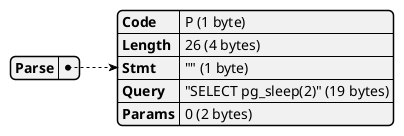

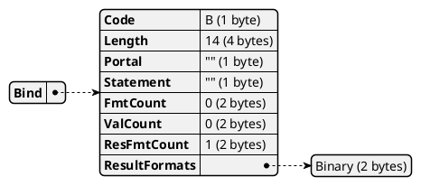

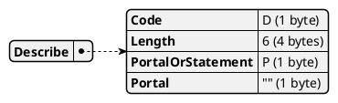

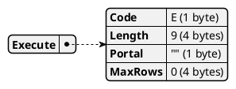

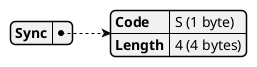

# Packet 2 (1 messages, FrontEnd --> BackEnd)

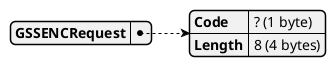

# Packet 3 (1 messages, FrontEnd <-- BackEnd)

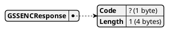

# Packet 4 (1 messages, FrontEnd --> BackEnd)

# Packet 5 (4 messages, FrontEnd <-- BackEnd)

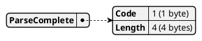

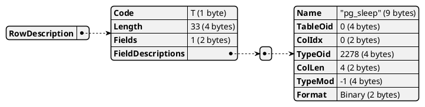

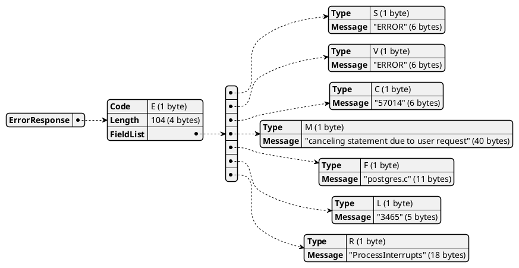

# Packet 6 (1 messages, FrontEnd <-- BackEnd)

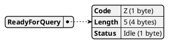

