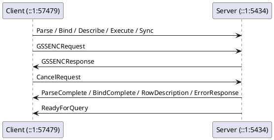

```plantuml
@startuml
participant "Client (::1:57479)" as C
participant "Server (::1:5434)" as S
C -> S : Parse / Bind / Describe / Execute / Sync
C -> S : GSSENCRequest
S -> C : GSSENCResponse
C -> S : CancelRequest
S -> C : ParseComplete / BindComplete / RowDescription / ErrorResponse
S -> C : ReadyForQuery
@enduml
```
